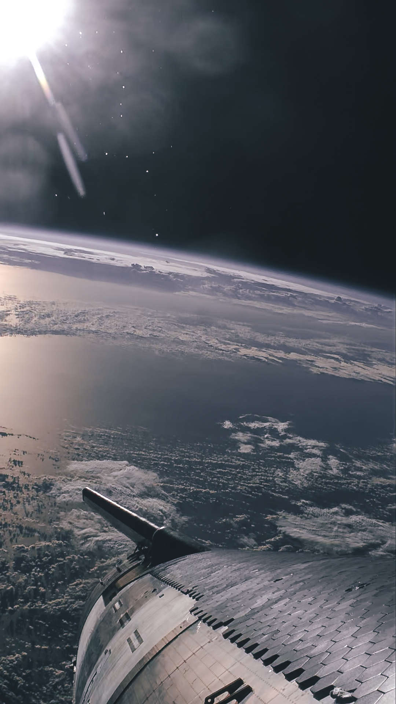

SpaceX返照，美丽但感觉加了滤镜。

- 1.项目： 大模型书籍summary [项目地址](https://levelup.gitconnected.com/build-an-ai-tool-to-summarize-books-instantly-828680c1ceb4)  
使用大模型总结书籍内容示例项目，涉及到文件读取、分块、embedding、聚类，可以参考。

- 2.项目： 大模型直接解析HTML [项目地址](https://serpapi.com/blog/web-scraping-and-parsing-experiment-with-ai-openai/)  
大模型获取HTML中所需信息，可参考用于xml分析、爬虫等。

- 3.工具： fzf [fzf](https://www.liuvv.com/p/a0700771.html)  
模糊搜索工具