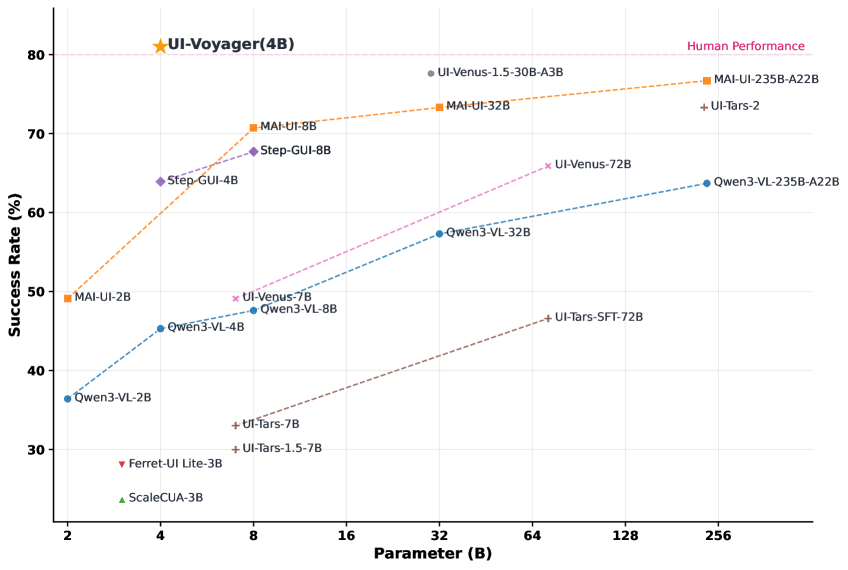
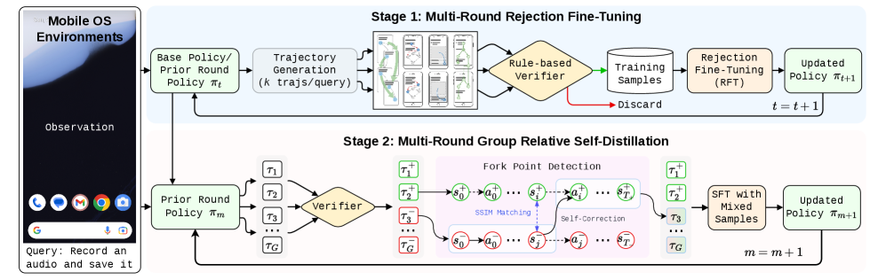
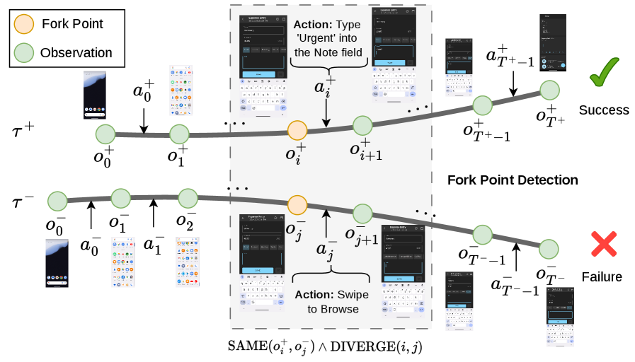
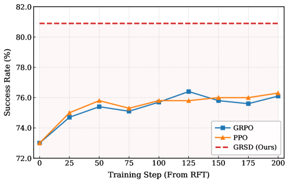

> 论文：**UI-Voyager: A Self-Evolving GUI Agent Learning via Failed Experience**  
> 作者：Zichuan Lin*, Feiyu Liu*, Yijun Yang*, Jiafei Lyu*, Yiming Gao*, Yicheng Liu*, Zhicong Lu, Yangbin Yu, Mingyu Yang, Junyou Li, Deheng Ye, Jie Jiang（Tencent Hunyuan）  
> 时间：arXiv:2603.24533v1，2026-03-25  
> 链接：[https://arxiv.org/abs/2603.24533](https://arxiv.org/abs/2603.24533)  
> 代码与模型：[https://github.com/ui-voyager/UI-Voyager](https://github.com/ui-voyager/UI-Voyager)

## 导读：失败不是垃圾数据，而是 GUI agent 最缺的老师

做 GUI agent / computer-use agent 时，最常见的失败不是“完全看不懂页面”，而是：前面 20 步都对，某一步点错、滑错、输入错，最后整条轨迹被判为失败。传统训练里，这类失败轨迹往往很难利用，因为系统只知道“这次没完成任务”，却不知道“到底哪一步开始偏航”。

UI-Voyager 这篇论文真正有意思的地方，就在于它把失败轨迹重新变成了训练信号。它先用 Rejection Fine-Tuning（RFT）不断自动生成任务、执行轨迹、过滤成功样本，让模型在闭环里变强；再用 Group Relative Self-Distillation（GRSD）对同一个任务的成功/失败轨迹进行对齐，找出“看到同一个界面却做出不同动作”的分叉点，把成功轨迹里的正确动作蒸馏给失败轨迹。

最终，UI-Voyager 的 4B 模型在 AndroidWorld 上达到 **81.0% Pass@1**，论文称超过了报告中的 human-level performance 80.0%。相比单纯堆更大模型，这个结果更值得工程侧关注：它说明 GUI 自动化的下一步，可能不是只靠更强的视觉语言模型，而是要把执行闭环、失败诊断、轨迹修复做成可持续进化的数据飞轮。

*图 1：论文 Figure 1。UI-Voyager-4B 在 AndroidWorld 上达到 81.0% Pass@1，作者用它强调“小模型 + 自进化训练”在移动 GUI 自动化上的效率优势。*

## 背景：GUI agent 的难点不只是定位，而是长程信用分配

过去一年，GUI agent 的研究重心已经从“能不能看懂屏幕、点到按钮”逐渐转向“能不能稳定完成长程任务”。在手机、桌面或 Web 环境中，一个真实任务通常不是单步操作，而是由一串状态转移组成：打开应用、进入页面、搜索、筛选、填写、确认、返回、验证结果……任意一步出错，后续观察都会偏离目标路径。

这类问题在强化学习里叫 **credit assignment**：任务最后失败了，应该把责任分配给哪一步？对于 GUI agent，这个问题尤其麻烦：

- **奖励稀疏**：很多环境只在轨迹结束后给成功/失败信号，过程里没有细粒度 reward。
- **状态部分可观测**：agent 通常只看到截图、历史动作和任务指令，而不是完整系统状态。
- **动作不可逆或代价高**：删除文件、修改设置、提交表单这类动作不能随意探索。
- **页面变化复杂**：同一个任务可能因为个性化、网络延迟、弹窗、输入法状态而出现不同界面。

UI-Voyager 选择的实验环境是 **AndroidWorld**。这是一个面向真实 Android 应用的移动 GUI benchmark，包含 116 类任务，并使用基于 adb 的规则检查器来判断任务是否完成。论文把 GUI 交互建模为 POMDP：agent 在每一步接收任务指令、当前截图和有限历史，然后输出一个结构化动作，例如 `click(x,y)`、`swipe(...)`、`input_text(...)`、`navigate_back()`、`status(success)` 等。

这一定义很贴近真实工程：无论我们做的是手机自动化、macOS 效率工具，还是 Web RPA，本质上都要在“有限观察 + 长程状态变化 + 最终验收”下做决策。

## 方法总览：两阶段自进化，把轨迹变成数据飞轮

UI-Voyager 的整体训练流程分两阶段：

1. **Rejection Fine-Tuning（RFT）**：让当前策略模型自动执行任务，使用规则验证器筛出成功轨迹，只用成功样本继续监督微调；如此迭代，让模型和数据一起进化。
2. **Group Relative Self-Distillation（GRSD）**：针对同一任务采样多条轨迹，比较成功轨迹与失败轨迹，在它们“看到相同屏幕但下一步动作不同”的位置找出分叉点，用成功动作修正失败上下文，生成步骤级监督样本。

*图 2：论文 Figure 2。左侧是 RFT 的成功轨迹筛选闭环；右侧是 GRSD 的失败轨迹修复流程。整篇论文的核心就是：先扩大成功数据，再从失败数据中挖出关键错误步骤。*

如果用工程语言翻译，RFT 像是一个“自动回归 + 成功案例沉淀”系统；GRSD 则像是一个“失败 case 的根因定位 + 自动生成修复补丁”系统。前者提高平均能力，后者解决长程任务里最难的局部错误归因。

### 阶段一：RFT，用成功轨迹推动模型自举

RFT 的流程并不复杂，但很实用：

- 从种子任务出发，自动生成或扰动任务实例。
- 当前 GUI agent 在 AndroidWorld 中执行任务，产生完整轨迹。
- 规则验证器判断任务是否成功。
- 只保留成功轨迹，把它们作为 SFT 数据继续训练模型。
- 用新模型重复上述过程。

这有点像 AlphaGo 式 self-play 的简化版本，只不过这里不是棋局，而是 GUI 操作轨迹。它的优点是成本低：不需要每一步人工标注，也不要求人类先录制大量高质量演示。只要环境能自动判断成功，系统就可以持续收集“模型自己已经会做的事”，再把这些行为固化下来。

但 RFT 也有天然上限。它只学习成功样本，失败样本被丢弃。对于本来就很难的任务，如果模型很少成功，RFT 很难获得足够多的正样本；对于“前 29 步都对、最后 1 步错”的轨迹，RFT 也无法利用前面那些正确部分。

这正是 GRSD 要补上的缺口。

### 阶段二：GRSD，找到成功与失败轨迹的分叉点

GRSD 的关键观察很朴素：对于同一个任务，多次 rollout 过程中，成功轨迹和失败轨迹经常会走到**相同或高度相似的屏幕状态**。如果它们在这个状态下选择了不同动作，并且之后走向不同结局，那么这个位置很可能就是失败轨迹的关键错误点。

论文把这种位置称为 **fork point**。检测逻辑大致如下：

- 对同一任务采样一组轨迹，其中包含成功轨迹和失败轨迹。
- 选取成功轨迹作为 teacher，失败轨迹作为 student。
- 使用截图相似度（论文中提到 SSIM）判断两个轨迹中是否出现相同/相似界面。
- 如果在相似界面之后，成功轨迹继续保持正确进展，而失败轨迹发生偏离，就把这里标记为分叉点。
- 用成功轨迹在该分叉点的动作和推理，替换失败轨迹中错误的下一步，构造成新的监督样本。

*图 3：论文 Figure 3。成功轨迹和失败轨迹在某个时刻看到相同屏幕，但下一步动作不同；GRSD 把这个位置识别为 fork point，并用成功轨迹的动作给失败轨迹提供步骤级纠正。*

这一步的价值非常大：它把“整条轨迹失败”这种粗粒度信号，转换成了“这个状态下应该做另一个动作”的细粒度监督。对于 GUI agent 来说，这比单纯给整条轨迹一个 0 分要有用得多。

更重要的是，GRSD 并不依赖人工逐步标注。它利用同一任务下多条轨迹之间的相对差异来产生监督，因此论文称之为 **Group Relative Self-Distillation**。这里的“relative”很关键：不是让外部专家告诉模型怎么做，而是在一组尝试中，让成功样本教失败样本。

## 关键创新：它真正解决的是失败经验利用率

我认为 UI-Voyager 最值得关注的创新不在“用了某个更强 backbone”，而在训练范式。

第一，它把 GUI agent 的数据闭环拆成了两类信号：**成功轨迹用于强化已有能力，失败轨迹用于定位能力边界**。很多自动化系统只会记录失败日志，却没有机制把失败日志转成训练数据；UI-Voyager 给出了一种可操作的路径。

第二，它绕开了标准在线 RL 在 GUI 场景中的低效问题。论文也对比了 PPO、GRPO 等方法：如果直接从基础模型开始做 RL，样本效率很低；即使从 RFT 模型开始，GRSD 也能更快地把性能推到 81.0%，而 PPO/GRPO 更容易在约 76% 附近平台化。

*图 4：论文 Figure 8。所有方法从同一个 RFT checkpoint 出发，GRSD 最终提升到 81.0% Pass@1，而 PPO/GRPO 提升更慢、平台更早。*

第三，它提供了一个“小模型参与复杂 GUI 工作流”的路线。UI-Voyager 是 4B 模型，却在 AndroidWorld 上超过许多更大模型。对于实际产品，这一点比榜单数字更重要：如果 GUI agent 要运行在本地设备、企业内网或低延迟场景，模型大小、推理成本和可部署性都会变成硬约束。

## 实验结果：4B 模型在 AndroidWorld 达到 81.0% Pass@1

论文的核心实验结论很直接：UI-Voyager-4B 在 AndroidWorld 上达到 **81.0% Pass@1 success rate**。作者报告它超过了表中多个近期 GUI agent baseline，也超过了报告中的 human-level performance 80.0%。为了可复现，论文称 UI-Voyager 的结果是 64 个随机种子的平均成功率，而 baseline 结果来自已有论文。

几个值得单独拿出来看的数字：

- RFT 能显著提升初始模型能力，论文在 Figure 4 中展示多轮 RFT 后 Pass@1 持续上升，并选择第三轮 RFT 的 checkpoint（Pass@1=73.2%）进入后续训练。
- 从同一个 RFT 模型出发，GRSD 最终将 Pass@1 提升到 81.0%。
- 在若干低成功率代表任务上，GRSD 相比 PPO/GRPO 更稳定，说明“分叉点纠错”对难任务尤其有帮助。

这组实验其实传递了一个工程判断：GUI agent 的能力提升不一定要从“更大模型 + 更多人工演示”开始，也可以从“可验证环境 + 自动执行 + 失败归因”开始。只要环境能给出稳定的完成判定，agent 就可以自我生产训练样本。

## 局限性：AndroidWorld 上的成功，不等于所有 GUI 场景通吃

UI-Voyager 的思路很漂亮，但落到真实产品还有几个明显限制。

首先，它依赖可靠的任务验证器。AndroidWorld 能通过 adb 和规则检查判断任务是否完成，这是 RFT/GRSD 能成立的基础。可是在真实 macOS、Web SaaS 或企业内部工具中，很多任务结果并不好验证。例如“把这份报告整理得更易读”“检查这个界面是否符合设计规范”“帮我完成一次复杂配置但不要影响已有项目”，这些目标很难用简单规则判定。

其次，分叉点检测依赖屏幕相似度。SSIM 对视觉相似状态有效，但 GUI 状态并不总是能从截图完全判断。两个截图看起来一样，背后可能有不同焦点、隐藏状态、剪贴板内容、文件系统状态；两个截图看起来不一样，也可能语义上等价。对于 desktop agent，窗口遮挡、多显示器、主题差异、弹窗位置变化都会放大这个问题。

第三，论文主要聚焦移动 GUI。移动端动作空间相对固定，系统形态也更统一；到了 macOS 或复杂 Web IDE，动作会引入快捷键、菜单栏、文件拖拽、终端命令、浏览器 DevTools、多窗口协同等。此时仅靠截图和坐标动作可能不够，最好结合 Accessibility Tree、DOM、应用 API、文件系统状态和 shell 工具。

最后，安全探索仍然是硬问题。论文环境中任务可控、可重置，而真实电脑里很多操作有副作用。GUI agent 如果要自我探索，必须有沙箱、快照、权限边界、可回滚机制，否则失败轨迹的采集本身就可能造成损失。

## 我的点评：GUI agent 的产品竞争点会转向“执行闭环”

如果把 UI-Voyager 放到更大的 computer-use agent 趋势里看，它强调的不是一个新 UI 操作模型，而是一套**让 agent 持续变好的机制**。

今天很多 GUI agent demo 看起来很惊艳：给一句话，它能打开浏览器、点按钮、填表、下载文件。但产品化之后，真正影响可用性的往往是下面这些问题：

- 失败后能否知道失败在哪一步？
- 同一个任务明天页面变了，能不能自我修复？
- 用户纠正一次后，系统能不能下次不再犯？
- 能否把执行日志、截图、动作、环境状态沉淀成回归测试？
- 能否在不上传敏感数据的情况下进行本地学习或个性化适配？

UI-Voyager 的 GRSD 给了一个很好的范式：不要把失败轨迹当作废品，而要把它当作“带有隐含对照组的训练材料”。只要同一个任务有多次尝试，只要其中存在成功样本，就可以反推出失败样本中某些关键决策的替代动作。

这对工程系统很有启发：一个 GUI agent 平台应该天然保存轨迹，而不是只保存最后结果。每次运行至少应记录任务指令、截图序列、动作序列、工具调用、环境状态摘要、最终验证结果。否则后续就无法做类似 GRSD 的失败归因。

## 对 macOS 研发效率工具与 GUI 自动化的启发

结合 macOS 研发效率工具，我觉得 UI-Voyager 至少带来四个产品设计启发。

### 1. 把“成功判定”做成一等公民

很多本地 agent 工具只关注 planner 和 executor，却忽略 verifier。UI-Voyager 证明，稳定的规则验证器是自进化的基础。对于 macOS 研发场景，可以把验证器设计成多层结构：

- 文件是否生成、内容是否符合 schema。
- Git diff 是否只修改了预期文件。
- 单测、lint、build 是否通过。
- UI 状态是否出现目标文字或组件。
- 用户定义的自然语言验收标准是否满足。

这样 agent 不只是“执行动作”，而是在每轮任务结束后形成可判定的结果，为后续数据沉淀提供标签。

### 2. 让失败运行可回放、可对齐、可修复

UI-Voyager 的 fork point 本质上要求轨迹可比较。macOS GUI 自动化也可以借鉴：当某个任务有一次成功运行和一次失败运行时，系统应该自动对齐它们的步骤，找出第一个状态相似但动作不同的位置。

例如，自动发布博客、配置 Xcode 项目、在浏览器后台管理系统中填写表单，这些任务经常有固定路径。若某次失败，可以和历史成功轨迹对齐：是不是弹窗多了一步？是不是按钮文案变了？是不是焦点落在了错误输入框？这种对齐能力会直接提升 self-healing。

### 3. 小模型 + 工具编排可能比单一大模型更适合本地执行

UI-Voyager-4B 的结果提醒我们：对于端侧 GUI agent，未必所有决策都要交给最大模型。更实际的架构可能是：

- 小模型负责高频、低延迟的 GUI grounding 和下一步动作预测。
- 大模型负责复杂规划、异常解释、用户沟通。
- 系统工具负责文件、Git、shell、浏览器、Accessibility Tree 等确定性操作。
- Verifier 负责验收，轨迹系统负责沉淀经验。

在 macOS 上，这种混合架构尤其合理。很多研发效率任务并不需要每一步都调用强大模型；真正需要的是把 GUI、CLI、文件系统、浏览器和 IDE 状态统一到一个可观测、可回滚、可验证的工作流里。

### 4. 从“自动操作界面”升级为“持续学习的个人工作流”

如果把 UI-Voyager 的思想产品化，GUI agent 不应该只是一次性帮用户点完界面，而应该逐渐学会用户的工作流。例如：

- 用户每天如何整理下载目录、命名文件、归档材料。
- 用户如何在 IDE 中创建分支、跑测试、提交 PR。
- 用户如何在数据看板中筛选指标、导出报表、生成周报。
- 用户如何在博客仓库中新增文章、插图、提交并发布。

这些流程都有重复性，也都有可验证结果。系统可以先通过规则和用户确认收集成功轨迹，再在失败时定位分叉点，逐步形成个人化的 GUI automation memory。长期看，这比“每次都从零规划”更稳定，也更接近真正可依赖的 computer-use agent。

## 总结

UI-Voyager 不是一篇只靠指标吸引人的论文。它真正值得关注的地方在于：把 GUI agent 训练从“收集演示数据”推进到“自动执行—验证—筛选—失败归因—再训练”的闭环。

RFT 让模型通过成功轨迹自举，GRSD 则把失败轨迹中最有价值的分叉点挖出来，转化为步骤级监督。对于所有做 GUI agent、桌面自动化、Web agent、移动端 agent 的团队来说，这个思路都很实用：**不要只优化 planner，也要建设 verifier、trajectory store 和 failure mining pipeline**。

如果未来的 macOS 研发效率工具能把这些模块做扎实，GUI agent 就不会只是“会点界面的大模型”，而会变成一个能从每次执行中学习、能解释失败原因、能持续适配个人工作流的自动化伙伴。