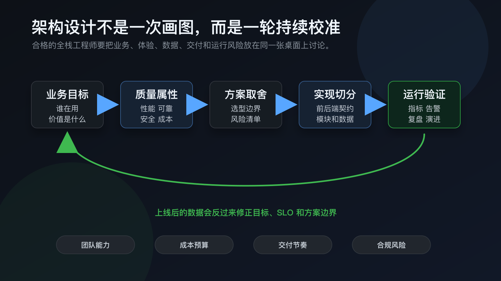
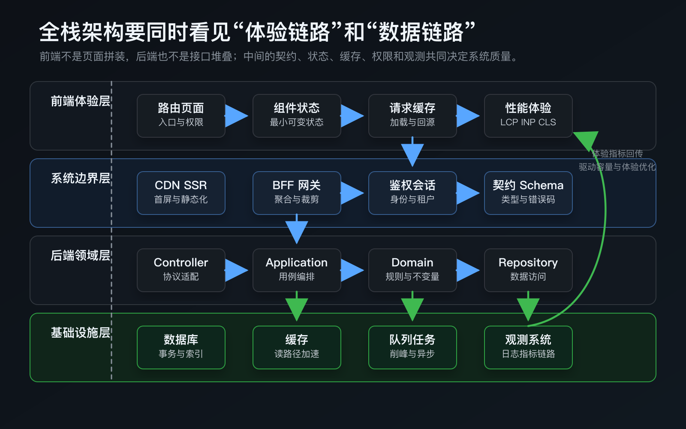
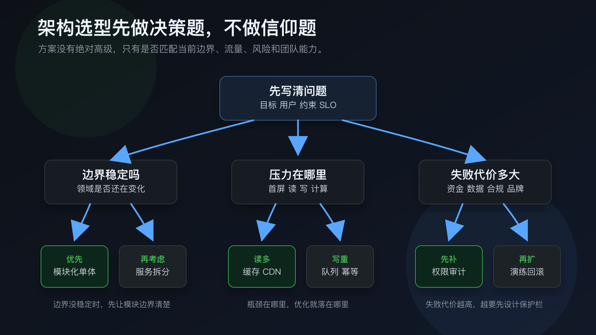

> 一句话结论：**架构设计不是把技术栈画大，也不是提前把系统拆碎，而是把业务目标翻译成可验证的工程取舍。**

作为全栈工程师做架构设计，最大的优势不是“前端也会、后端也会”，而是你能沿着用户的一次操作，从浏览器里的交互、组件状态、请求缓存，一路看到 API、领域规则、数据库、队列、部署、监控和回滚。也正因为你能看到整条链路，架构设计时更容易判断：这个问题应该在前端解、在后端解、在数据层解，还是应该先不解。

我认为合格的架构设计至少要回答四类问题：

- **为什么做**：业务目标是什么，用户是谁，成功指标是什么。
- **做到什么程度**：性能、可靠性、安全、成本、交付速度谁优先。
- **怎么分工**：前端、后端、数据、基础设施、第三方系统分别负责什么。
- **怎么验证**：上线后靠什么指标知道方案是对的，出问题怎么定位和回滚。



*图 1：架构设计从业务目标出发，经过质量属性、方案取舍和实现切分，最后必须回到运行验证。上线后的数据会反过来修正目标、SLO 和方案边界。*

## 先别选技术，先写清约束

很多架构讨论一开始就跑偏，是因为团队先问“用不用微服务”“要不要上 SSR”“选 PostgreSQL 还是 MongoDB”，却没有先问清楚系统到底要承受什么。

架构设计的第一步应该是把需求翻译成约束。这里的约束不只是流量，还包括用户预期、合规、团队能力、交付节奏和失败代价。AWS Well-Architected Framework 把架构评估拆成运营卓越、安全、可靠性、性能效率、成本优化和可持续性几个支柱；这类框架的价值不在于照抄云厂商方案，而是提醒我们：架构从来不是单维度优化。

一个简单的全栈架构需求表可以这样写：

| 维度 | 要问的问题 | 前端关注 | 后端关注 |
| --- | --- | --- | --- |
| 用户体验 | 用户最不能忍受什么 | 首屏、交互延迟、空状态、错误恢复 | API 延迟、降级、稳定响应 |
| 可靠性 | 什么失败会影响核心业务 | 重试、离线提示、局部失败 | 超时、幂等、熔断、回滚 |
| 安全 | 哪些数据和操作最敏感 | XSS、权限态、敏感信息展示 | 鉴权、授权、审计、注入防护 |
| 性能 | 瓶颈在读、写、计算还是渲染 | LCP、INP、CLS、资源体积 | QPS、慢查询、缓存命中、队列积压 |
| 成本 | 哪些资源最贵 | 包体、CDN、第三方 SDK | 存储、计算、带宽、外部服务 |
| 演进 | 哪些需求最可能变化 | 路由、组件、状态模型 | 领域边界、表结构、接口契约 |

如果这些问题没有答案，架构图画得越漂亮越危险。因为你不知道自己在优化什么，也不知道哪些复杂度是必要的。

## 前端架构：先切体验链路，再切组件

前端架构不是目录分层的游戏。真正要设计的是用户从进入页面到完成任务的体验链路，以及这条链路背后的状态、数据和渲染策略。

我通常先看五件事。

第一是 **路由和信息架构**。用户从哪里进来，核心任务路径有几步，每一步需要哪些权限和数据。路由不仅是 URL，它决定了页面是否可分享、是否可缓存、是否能独立加载，也决定了错误和空状态在哪里出现。

第二是 **渲染策略**。营销页、文档、博客更适合 SSG 或 SSR；强交互后台可能更多依赖 CSR；电商、内容流、搜索页常常需要混合策略。不要把 SSR 当银弹，它改善首屏和 SEO 的同时，也会增加服务端资源、缓存策略和水合复杂度。

第三是 **组件边界**。组件应该围绕业务语义拆，而不是围绕视觉碎片拆。`UserCard`、`OrderTimeline`、`PermissionPanel` 通常比 `LeftBox`、`RightWrapper` 更稳定。视觉组件可以沉到 UI 层，业务组件要承载状态、权限和数据含义。

第四是 **状态结构**。React 官方文档里反复强调一个原则：能从 props 或已有 state 计算出来的数据，不应该再复制成一份 state。这个原则放到全栈视角也成立：前端不要保存太多“服务端真相”的副本，否则缓存、表单草稿、乐观更新、回滚都会变复杂。要分清本地交互状态、服务端缓存状态、URL 状态、全局会话状态。

第五是 **体验指标**。web.dev 现在把 Core Web Vitals 稳定指标聚焦在 LCP、INP、CLS：加载速度、交互响应和视觉稳定性。前端架构设计不能只写“做性能优化”，而要明确核心页面的资源预算、图片策略、代码分割、预加载、埋点和真实用户监控。

前端架构设计交付物至少应该包含：

- 页面和路由结构。
- 核心用户路径和状态图。
- 数据请求、缓存、刷新和错误策略。
- 权限态、登录态、租户态的展示规则。
- SSR/SSG/CSR/边缘渲染的选择理由。
- 核心页面的性能预算和观测指标。

## 后端架构：先找领域边界，再谈服务拆分

后端架构最常见的误区，是把“拆服务”当成高级，把“单体”当成落后。Martin Fowler 在 Monolith First 里提到一个很关键的经验：很多成功的微服务故事是从一个变大的单体演进出来的，而从一开始就做微服务的系统往往会付出很高的分布式复杂度成本。

这并不是说单体永远正确，而是说服务边界需要时间和业务事实来校准。早期系统更应该做的是 **模块化单体**：代码在一个部署单元里，但领域模块、依赖方向、数据访问、接口边界要清楚。这样既能保持交付速度，又给未来拆分留下空间。

一个健康的后端模块通常可以按职责分层：

- **Controller / Handler**：处理 HTTP、RPC、WebSocket 等协议细节。
- **Application Service**：编排一个业务用例，处理事务、权限、外部调用。
- **Domain**：表达领域规则、不变量和核心状态变化。
- **Repository / Gateway**：隔离数据库、缓存、消息队列、第三方服务。
- **Infrastructure**：日志、配置、任务调度、存储、运行时依赖。

这里的重点不是每个项目都要套固定目录，而是依赖方向要清楚：领域规则不应该依赖 HTTP 框架，核心业务不应该散落在 Controller 和 SQL 拼接里，第三方服务异常不应该直接污染用户可见错误。

后端还要从一开始就设计运行方式。Twelve-Factor App 里提到的配置环境化、显式依赖、构建发布运行分离、把数据库/队列/缓存当作附加资源，在今天仍然是很实用的底线。它们解决的不是“云原生名词”，而是系统能不能稳定部署、迁移、扩容和排障。

## 中间那层：接口契约才是全栈系统的骨架

前后端协作最容易变形的地方，是接口只描述“返回什么字段”，没有描述“这个字段在什么状态下出现、为空代表什么、错误如何恢复、是否允许重试”。

一个好的接口契约至少要覆盖：

- 请求参数、响应结构、分页、排序、过滤。
- 错误码、错误文案、用户可恢复动作。
- 鉴权、授权、租户隔离和敏感字段脱敏。
- 幂等键、重试语义、超时语义。
- 版本策略和兼容策略。
- Trace ID、Request ID、埋点字段。
- Mock 数据、契约测试和类型生成。

如果前端需要把三个接口拼成一个页面，且每个页面都重复这套拼装，就应该考虑 BFF 或 API 聚合层。如果后端领域接口直接暴露给多个不同端，导致移动端、Web、后台管理系统都在各自猜字段含义，也应该考虑用 Schema、SDK 或适配层收敛语义。

接口契约不是文档负担，而是降低沟通成本的工具。它让前端知道有哪些状态要画，让后端知道哪些行为不能随意改，也让测试知道应该怎么构造边界用例。



*图 2：全栈架构可以按体验层、边界层、领域层和基础设施层来看。前端体验指标不只是前端问题，它会反向影响缓存、接口聚合、容量和观测设计。*

## 数据设计：先确定真相来源，再讨论缓存和异步

数据层的核心问题不是“选哪个数据库”，而是谁拥有数据真相，以及什么时候允许不同副本短暂不一致。

我会先问这几类问题：

- 哪个模块拥有这份数据的写入权。
- 哪些页面或服务只是读取投影。
- 哪些操作必须强一致，哪些可以最终一致。
- 写入失败后能否重试，重试是否幂等。
- 缓存失效靠 TTL、事件、版本号还是主动删除。
- 异步任务失败后谁补偿，用户能否感知。
- 数据增长后按什么维度归档、分区或冷热分离。

读多写少的系统，通常先看 CDN、浏览器缓存、服务端缓存、索引和读模型；写入压力大的系统，通常先看事务边界、幂等键、队列削峰、批处理和补偿机制；强一致要求高的系统，要谨慎引入异步拆分；数据敏感的系统，要先设计权限、审计、脱敏和删除策略。

缓存尤其要克制。缓存不是免费的性能优化，它引入了新的状态副本。只要有副本，就要回答“什么时候过期、谁来更新、读到旧数据是否可接受、如何排查脏读”。如果这些问题答不上来，缓存命中率越高，事故越隐蔽。

## 可观测性：架构不是上线那天结束

没有观测的架构设计，本质上只是猜测。Google SRE 书里讲监控时强调，仪表盘应该回答服务的基本问题，告警应该低噪音、可理解，并且能让人知道哪里坏了、为什么坏了。

全栈系统至少需要三层观测。

第一层是 **用户体验观测**：页面打开时间、关键交互耗时、前端异常、资源加载失败、白屏率、关键路径转化率。

第二层是 **服务端观测**：请求量、错误率、延迟、饱和度、慢查询、队列积压、缓存命中率、外部依赖耗时。

第三层是 **业务观测**：订单创建数、支付成功率、内容发布成功率、审核积压、任务完成率。这些指标能告诉你技术指标背后的业务影响。

这三层最好能通过 Trace ID 串起来。用户点击一次按钮，前端埋点、API 请求、服务日志、数据库慢查询和异步任务应该能在同一条链路里被找到。否则事故发生时，团队会在“前端说接口慢、后端说数据库没问题、运维说机器正常”的循环里消耗时间。

## 安全设计：别把安全留到上线前

安全不是最后做一次扫描。OWASP ASVS 的价值在于它把 Web 应用安全拆成可验证的要求，能帮助团队把安全控制前移到设计和开发阶段。

全栈架构里的安全至少要覆盖：

- 身份认证：登录、会话、Token 生命周期、多因素认证。
- 授权模型：角色、资源、租户、数据范围、越权测试。
- 输入输出：注入防护、XSS、防止模板和 Markdown 渲染污染。
- 敏感数据：加密、脱敏、最小化采集、日志屏蔽。
- 操作审计：谁在什么时候对什么资源做了什么。
- 供应链：依赖来源、构建环境、密钥管理、第三方脚本。

前端要避免把权限只做成按钮隐藏；后端要避免只校验“是否登录”而不校验“是否能操作这个资源”。真正的权限设计应该靠后端强制执行，前端负责正确表达和减少误操作。

## 选型：做决策题，不做信仰题

架构选型应该像做决策树，而不是像站队。每个选择都要能说清楚“解决什么问题、引入什么成本、什么时候需要撤回”。



*图 3：架构选型先看边界、压力和失败代价。边界不稳定时先做模块化；瓶颈在哪里，优化就落在哪里；失败代价越高，越要先设计保护栏。*

几个常见决策可以这样判断。

**模块化单体还是微服务**：如果团队规模不大、领域边界还在变化、部署和观测能力还不成熟，优先模块化单体。只有当模块之间的变化节奏、扩展需求、团队边界和数据边界都比较清楚时，再拆服务。微服务解决的是独立演进和独立扩展，不是代码混乱。

**前端直连 API 还是 BFF**：如果页面只是简单读取领域资源，直连 API 足够。如果页面需要聚合多个后端、裁剪字段、适配多端差异、统一权限和降级，BFF 更合适。但 BFF 也会变成新的一层业务逻辑，必须控制边界。

**SSR、SSG 还是 CSR**：内容稳定、需要 SEO、首屏重要的页面，优先 SSG/SSR；强登录态、强交互、后台工具类页面，可以更多依赖 CSR；混合应用要明确哪些数据在服务端取，哪些状态留给客户端。

**同步还是异步**：用户必须马上知道结果的操作适合同步；耗时、可重试、可补偿的操作适合异步。异步不是把问题扔进队列，它要求任务状态、重试、死信、幂等和用户反馈一起设计。

**缓存放在哪里**：静态资源放 CDN，接口读模型放服务端缓存，用户局部状态放浏览器缓存。缓存越靠近用户，体验越好，但失效和权限风险也越要小心。

## 架构设计文档应该长什么样

架构设计文档不需要写成论文，但必须能支持评审、实现和复盘。我推荐用这个骨架：

```text
1. 背景和目标：为什么做，成功指标是什么。
2. 非目标：这次明确不解决什么。
3. 约束：时间、团队、成本、合规、已有系统。
4. 质量属性：性能、可靠性、安全、成本的优先级。
5. 总体方案：C4 Context / Container 或同等层级的图。
6. 前端设计：路由、渲染、状态、数据请求、性能预算。
7. 后端设计：领域模块、接口、数据、事务、异步任务。
8. 契约设计：Schema、错误、鉴权、版本、Mock 和测试。
9. 运行设计：部署、配置、监控、告警、回滚、容量。
10. 风险和取舍：为什么这样选，备选方案为什么不选。
11. 里程碑：如何分阶段交付，如何验证每一阶段。
```

C4 模型里说，不同层级的图服务不同读者，大多数团队只需要系统上下文图和容器图就能讲清楚主要结构。这个判断很实用：图不是越细越好，而是要让业务、产品、前端、后端、测试、运维都能在同一张图上对齐。

## 评审时重点看什么

我做架构评审时，会优先看这些问题：

- 目标是否清楚，还是只是在展示技术栈。
- 质量属性是否排序，还是想同时要快、稳、省、灵活。
- 前端状态和服务端数据真相是否冲突。
- API 契约是否覆盖错误、权限、分页、版本和兼容。
- 事务边界和异步边界是否清楚。
- 缓存是否有失效策略和排查路径。
- 安全控制是否在后端强制执行。
- 核心链路是否有指标、日志、Trace 和告警。
- 发布失败后是否能回滚，数据失败后是否能补偿。
- 方案是否能小步交付，而不是一次性赌大重构。

这些问题看起来朴素，但能挡住大量事故。架构设计的成熟度，很多时候就体现在团队是否愿意把这些朴素问题问到底。

## 我的经验判断

全栈工程师做架构设计，最重要的不是熟悉多少框架，而是能把复杂问题拆成三层：

第一层是 **用户路径**：用户怎么完成任务，哪里最影响体验。

第二层是 **系统边界**：前端、后端、数据和第三方系统分别承诺什么。

第三层是 **运行反馈**：系统上线后，靠什么知道它在变好还是变坏。

如果这三层能对齐，技术选型会自然很多。你会知道哪些地方应该简单，哪些地方值得复杂；哪些问题应该现在解决，哪些问题应该等事实出现；哪些抽象是为了复用，哪些抽象只是为了显得高级。

好的架构不是一开始就完美，而是允许系统在真实压力下持续演进。它应该让团队更快交付、更容易定位问题、更敢修改代码，也更清楚每一次取舍背后的代价。

## 参考资料

- [AWS Well-Architected Framework](https://docs.aws.amazon.com/wellarchitected/latest/framework/welcome.html)
- [The Twelve-Factor App](https://www.12factor.net/)
- [OWASP Application Security Verification Standard](https://owasp.org/www-project-application-security-verification-standard/)
- [web.dev: Web Vitals](https://web.dev/articles/vitals)
- [Google SRE Book: Monitoring Distributed Systems](https://sre.google/sre-book/monitoring-distributed-systems/)
- [C4 model: Diagrams](https://c4model.com/diagrams)
- [React: Thinking in React](https://react.dev/learn/thinking-in-react)
- [Martin Fowler: Monolith First](https://martinfowler.com/bliki/MonolithFirst.html)
