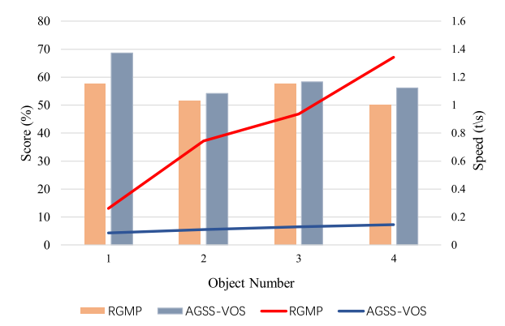
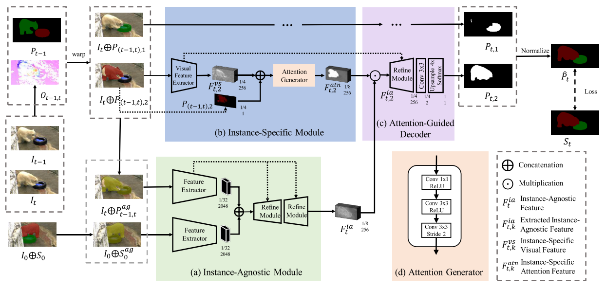
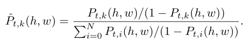
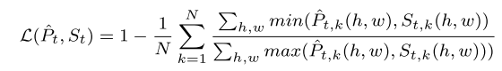
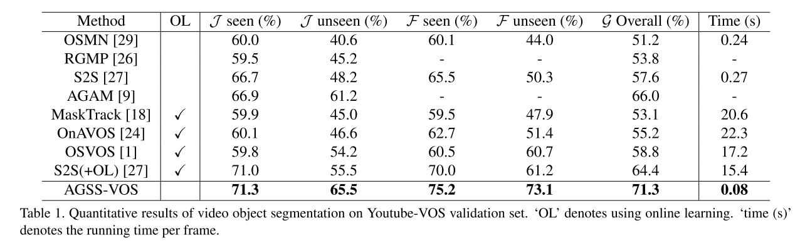
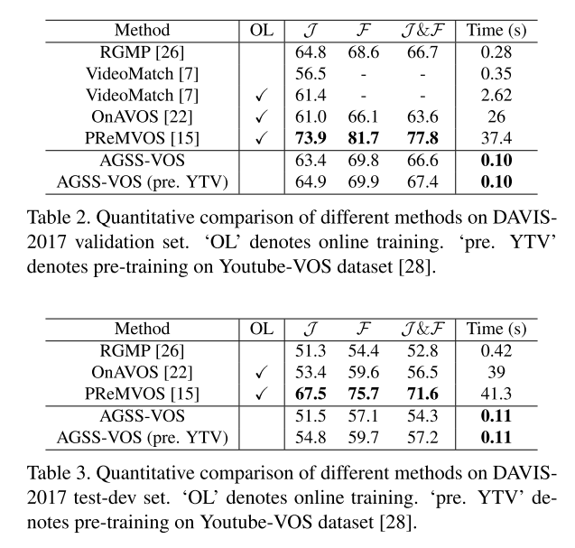

此篇文章为iccv2019中关于视频分割的一篇文章，主要针对多物体进行视频object分割，值得一读
<!--more-->

## AGSS-VOS
论文地址：  
[AGSS-VOS: Attention Guided Single-Shot Video Object Segmentation](http://openaccess.thecvf.com/content_ICCV_2019/papers/Lin_AGSS-VOS_Attention_Guided_Single-Shot_Video_Object_Segmentation_ICCV_2019_paper.pdf)

大多数的视频分割方法每次只能处理一个object，当一个视频序列需要分割多个object时，这种方法就会非常耗时。此篇文章作者提出一个方法，只用一次前向传播，经过模糊实例和细分实例两个模块，将多个object进行一次性分割出来，整个网络框架是端到端的。作者在论文开头放了一张实验效果图，是与**RGMP**(一次传播只分割一个物体的典型方法)做了对比，如下图：

可以看到，当视频物体数量上升的时候**RGMP**的推理时间在不断上升，而本文的方法依旧处在一个比较快速的水平，不会因物体的数量而大幅度影响推理速度。我们下面来看一下本篇文章的网络框架：

### 网络框架

整个框架，初看非常复杂，不知道从哪里入手，这主要是因为输入比较多，一旦把输入一个一个理清楚，后面的网络部分是非常简单的。此方法与**RGMP**一样，输入一共有三帧，预测帧，预测的前一帧以及初始帧，分别为 **It, It-1, I0**。同时，也加入了前一帧以及初始帧的mask。

#### Instance-Agnostic Module

整个网络分为三大块，首先介绍**Instance-Agnostic Module**这一模块，此模块的输入有两个，一个是初试帧的image及mask的叠加，另一个是预测帧及预测前一帧mask的扭曲的叠加。这两个mask都是与instance无关的，也就是每一个instance全都混在一起取一个值，预测前一帧mask的扭曲是根据当前帧及前一帧得到的光流操作后得到的。两个image+mask经过一个孪生网络，然后concat起来，会得到一个与instance无关的，相当于是只分出前景的attention。

#### Instance-Specific Module

此模块的输入是当前帧image与扭曲mask的叠加，同时若有N个object，就会有N个这样的叠加，每一个代表一个object。每一个输入都经过一个轻型Encoder，输出再与扭曲mask再concat一次，经过一个**Attention Generator**生成attention，如图中的(d)。通过这个模块就可以得到每一个object单独的预测。

#### Attention-Guided Decoder

在这一模块中，把两个模块的输出进行点乘，就会得到每个object的最终预测了。有了最终预测之后还需要一次Normalize，这一步主要是因为预测会有重叠部分，而一个像素只能代表一个object所以需要有一个操作来进行重叠区域的处理，normalize的公式如下：

### Training Loss
Loss部分作者使用了IoU Loss：

训练的具体细节可以去原文中看，在这里不再赘述。

### Experiments

作者在 **Youtube VOS** 和 **DAVIS-2017** 上进行了实验 效果都很好。

