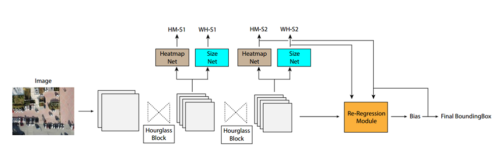
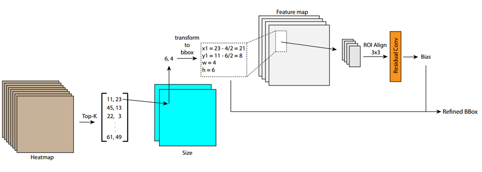
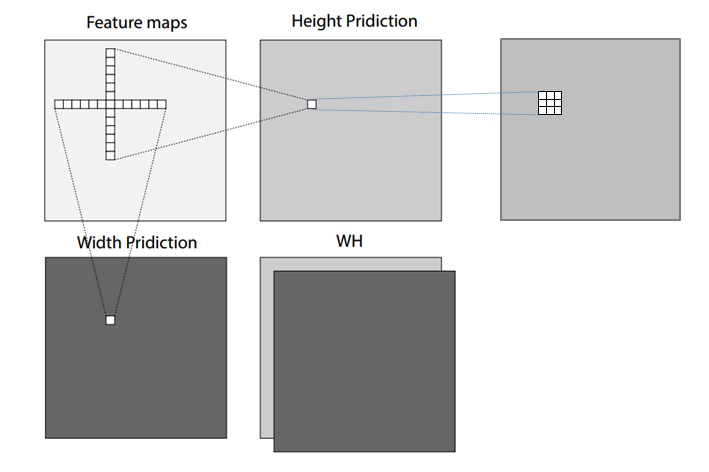
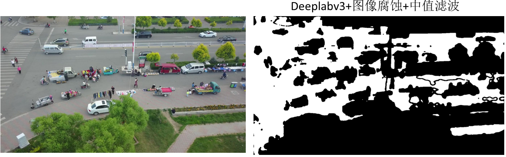
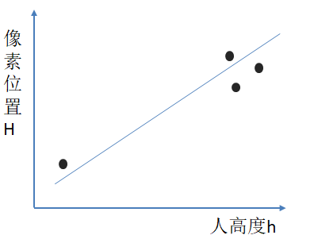
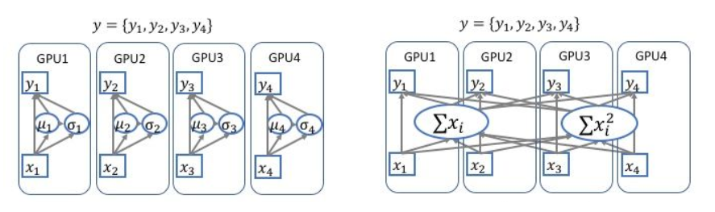
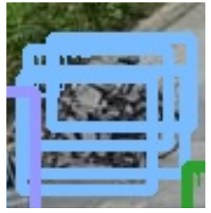

简单介绍本组VisDrone2019比赛Object Detection in Images任务所采用的算法方法。

<!-- more -->

## Introduction

### RRNet

本次比赛提出并采用的网络框架为——RRNet，主要思想为将单阶段anchor-free算法(CenterNet)通过**再次回归**变为二阶段算法，通过再回归的方式让本就较精确的bbox更加精准。下图为网络框架图：

RRNet Struecture

网络主体为[CenterNet](https://arxiv.org/abs/1904.07850),backbone为hourglass-104，两个hourglass block的输出全部参与分类及回归，Heatmap代表中心点的激活图，Size代表中心点所对应object长宽的激活图，输出的一共4个map分别进行focal loss和l1 loss的计算。此上为[CenterNet](https://arxiv.org/abs/1904.07850)的主要部分，接下来我们继续利用其输出的特征图，送入后面的Re-Regression Module进行二次回归。Re-Regression Module内部结构如下：

Re-Regression Module

通过[CenterNet](https://arxiv.org/abs/1904.07850)生成的Heatmap以及SIzemap，我们可以直接将其转换成为bbox，得到bbox之后(我们可以将其类比为faster-rcnn中RPN网络生成的候选框)，我们将这些候选区域送入ROI Align，进行再一次回归得到偏移量，将此偏移量加到原始bbox上的到修正后的输出。 

## Major features

除了再回归网络，我们还采用了以下一些方法让性能进一步提升：

|method|mAP|
|------|------|
|1.two-stage/multi-stage|↑2%|
|2.wh conv|↑0.3%|
|3.re-sample|↑1%|
|4.multiscale training/test|↑2%|
|5.sync training|↑1%|
|6.nms/soft nms|↑1%|
|7.KL-Loss|(↑1%?)|
|8.warm up lr|-|
|9.mix up|-|
|10.ellipse gaussian|-|

## Details

### 1.two-stage/multi-stage

two-stage便指再回归思想，对于进行多次回归(multi-stage)我们目前还没有进行实验。这个再回归让mAP提高了2%

### 2.wh conv

对于[CenterNet](https://arxiv.org/abs/1904.07850)中SIzemap的回归是单纯使用3x3卷积，我们认为这种卷积核并不能get到整个object的全部信息，从而以这种方式推理出object的长与宽是不合理的，于是我们采用1xk，kx1的卷积核分别推理object的宽和长，这样可能会获得更多有效信息。 此方法提升了0.3%的mAP。

wh conv

### 3.Data Augmentation

简单介绍一下数据增强方面所采用的一些方法

#### re-sample

我们发现对于people，pedestrian等小目标的类准确率非常低，于是采用了将hard-sample再次采样(复制)放到图上进行训练的方式。考虑到背景信息，我们首先使用在Cityscapes数据集上训好的deeplabv3以及图像腐蚀+中值滤波在我们自己的无人机数据集上分割出道路，这样复制出的人，自行车一类就可以让他们放在道路上而不是天上或楼上。

与此同时，由于镜头视角的缘故，在同一张图片中一个人的大小是不同的，直接复制出来填到任意一个地方也是不合理的，于是我们为了解决这个问题，首先在图中找到一个像素h(高度)最矮的一个人，同时再找三个h最高的人，建立一个人的高度h与图片像素位置H的线性关系，这样就可以根据要插入的位置，计算人应有的高度放进去也就不违和了。

#### multiscale training/test

此方法比较普遍，就不过多介绍了，基本对于任何算法(检测、分割)都可以提升最终的准确率。

#### mix up

通过将同一batch中的随机两两图片间进行按一定比例线性叠加，同时loss回传也按照此比例回传。论文中表明有用，但在我们的任务上性能并没有提升。

#### Random Crop | flip | Normalization

随机裁剪为600x600，水平翻转及正则化。

### 4.sync training

因为用的多卡进行训练，采用同步bn优化收敛过程。效果提升1%

### 5.nms/soft nms

由于此数据集中重叠物体较多，采用普通nms会将许多TP框去掉，于是采用softnms，缓解此现象的影响。

### 6. KL-Loss

由于视角问题，在同一张图片中，同一类物体的大小可能相距甚远，这会影响训练，那么如何才能减少此影响呢。我们将object的分布假设为正态分布，使用KL-Loss，拉近同类物体之间在特征图上的特征分布。这在没有使用multiscale training / test的时候有1%的提升，但当用了之后便没有效果，可能是与multiscale相冲突了。

## Results

在val上mAP为39.4%

## Acknowledgement

RRNet是一个采用了再回归思想的two stage anchor-free目标检测算法，通过二阶段回归获得更加精准bbox。欢迎大家在此工作上提出新的意见建议，也希望大家可以把博客网站利用起来，积极分享有用的知识，一起加油:smile:

