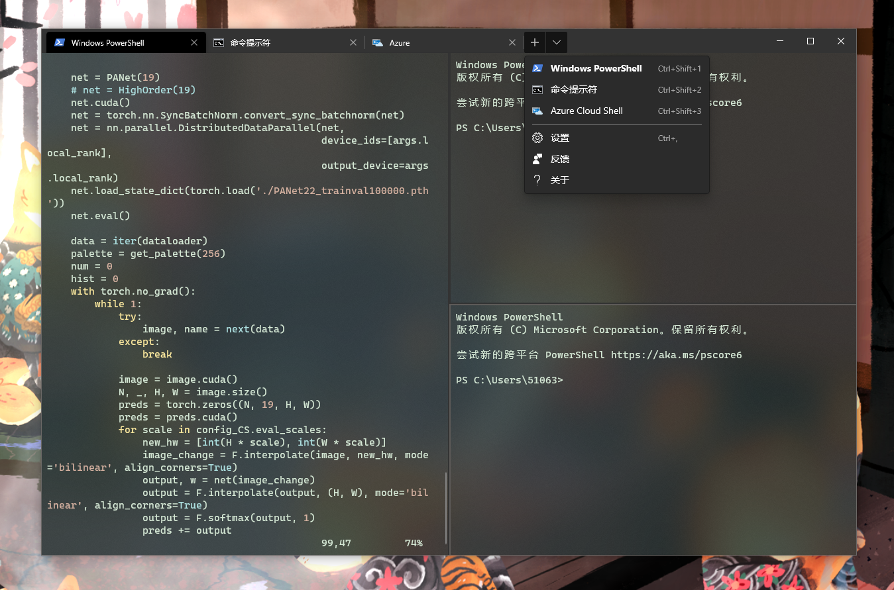
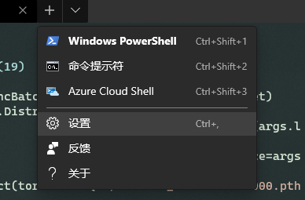
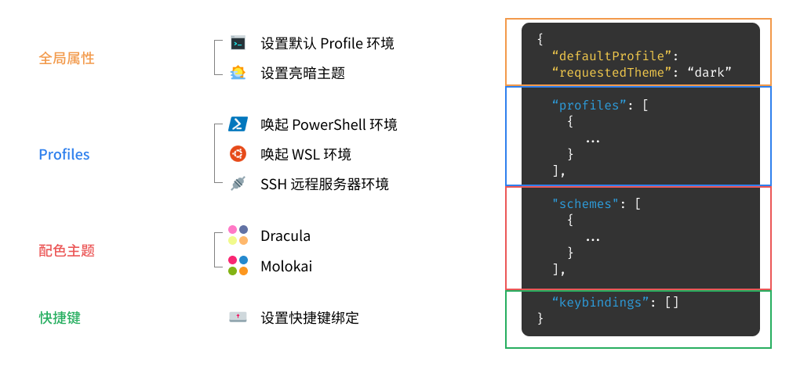
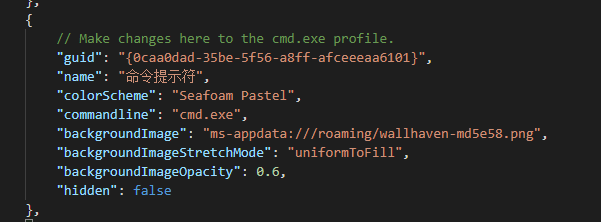
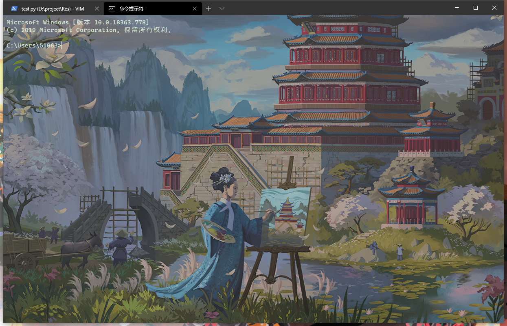
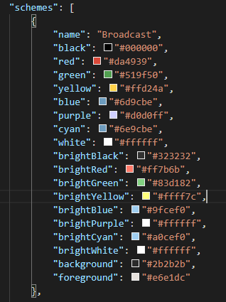
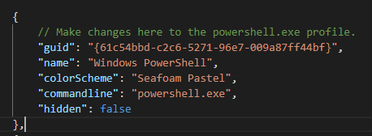
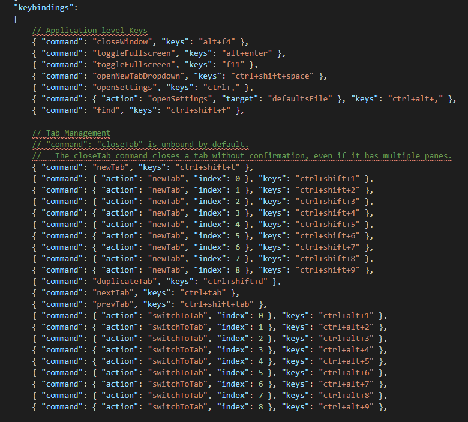

记录Windows Terminal配置过程

## Windows Terminal
Windows Terminal 作为一名新晋的Windows终端，当然要来试一下。 目前Windows Terminal已经趋于成熟，个人感觉已经可以让它成为主力终端， 它实现了社区用户热切期望的许多功能(如多标签、主题样式、可配置性、富文本等)，并保持了快速与高效，不会消耗大量内存与电量。下面简单记录一下配置过程。

[Windows Ternimal GitRep](https://github.com/microsoft/terminal)



---

## Windows Terminal Installation

Windows Terminal已经在微软商店上架，如果可已登录microsoft store，直接在商店搜索安装即可。

如果没有办法使用，可以在[release](https://github.com/microsoft/terminal/tags) 下载Microsoft.WindowsTerminal_1.1.1671.0_8wekyb3d8bbwe.msixbundle直接安装即可。

也可以用chocolatey安装：
```
choco install microsoft-windows-terminal
```

安装好后，WT的界面是有些丑的... 下面讲一下如何进一步配置WT。

---

## Windows Terminal Settings
首先我们要进入Windows Terminal的配置文件，在下拉菜单中，选择设置/Settings，这一操作会使用系统默认文本编辑器打开Windows Terminal的配置文件。


配置文件是一个JSON格式文件，我们可以在其中定义全部Windows Terminal的属性。 结构非常清晰，大致上，配置包含如下几个部分：

- 全局属性：位于最外侧，包含设置亮暗主题、默认Profile等项目的配置。
- profiles：主要功能为定义从下拉菜单中唤起的各种环境(如PowerShell，WSL，cmd等)，以及各种环境的显示方案(主题、背景、字体等)。
- schemes：配色主题，可以去[iTerm2-Color-Schemes](https://github.com/mbadolato/iTerm2-Color-Schemes)里找喜欢的
- keybindings：自定义快捷键的绑定。



---

### Appearance Configuration

**调整背景**

Windows Terminal的背景可以是一种纯色，也可以是一张高清壁纸，GIF动图等。纯色背景可以直接设为默认，也可以根据你的colorSchemes(我们的配色主题)改变，也可以在profiles的每个环境里面单独设置。同时我们让背景添加透明的亚克力着色，就可以使用下面三条指令：

```
"profiles":
    {
        "defaults":
        {
            // Put settings here that you want to apply to all profiles.
            "background": "#013456",
            "useAcrylic": true,
            "acrylicOpacity": 0.8
        },
```

当然我们也可以让一张图片作为背景，我们首先进入Windows Terminal安装目录`C:\Users\{用户名}\AppData\Local\Packages\Microsoft.WindowsTerminalPreview_8wekyb3d8bbwe`里面的`RoamingState`文件夹，将壁纸放入其中。之后在配置文件加入以下内容：

```
{
    "backgroundImage": "ms-appdata:///roaming/wallhaven-md5e58.png",
    "backgroundImageStretchMode": "uniformToFill",
    "backgroundImageOpacity": 0.6
}
```


这样我们的背景就添加进去啦！



---

**更换文本背景主题**

这里推荐全网最丰富的终端配色方案：[iTerm2-Color-Schemes](https://github.com/mbadolato/iTerm2-Color-Schemes)。找到喜欢的主题风格，记下名字，去windowsterminal中找到相应json文件，复制其中内容到`settings.json`的schemes中：


然后在相应环境里面添加`"colorScheme": "Seafoam Pastel",`就可以啦！


---

**配置所启动的环境**

Windows Terminal唤起环境时，是用配置文件里面的`commandline`这一属性定义的命令来进入相应环境。所以我们可以自定义执行的命令。我们以SSH远程登录为例子来介绍：

默认的环境就是cmd与powershell了：
```
{
    "guid": "{61c54bbd-c2c6-5271-96e7-009a87ff44bf}",
    "name": "Windows PowerShell",
    "colorScheme": "Seafoam Pastel",
    "commandline": "powershell.exe",
    "hidden": false
},
```

我们可以在唤起时同时执行ssh命令，用一个不同的UUID([在线UUID生成器](https://www.uuidgenerator.net/))来新建一个选项：
```
{
    "guid": "{a060905f-d089-43d9-9422-cd748e7f0230}",
    "name": "SSH Lab",
    "colorScheme": "Seafoam Pastel",
    "commandline": "powershell.exe ssh root@10.0.0.1",
    "hidden": false
},
```
如果想要更加美观，还可以添加一个图标：
{
  "icon": "ms-appdata:///roaming/icon.png"
}

进入WSL同理可用这个自己定义一个。

---

**绑定快捷键**

在 Windows Terminal 的配置文件末尾，我们可以在 `"keybindings": []` 里定义其快捷键绑定。默认的 Windows Terminal 快捷键实际上就非常好用，可以用来快速开启某个环境、实施分屏操作等。这里举几个比较典型的、无需设置即可使用的例子：

- `Ctrl + Shift + T` 打开新标签页
- `Ctrl + Shift + 1` 进入配置文件中定义的第一个环境（`Ctrl + Shift + 2` 进入第二个，以此类推）
- `Alt + Shift + -` 横向分屏；`Alt + Shift + +` 纵向分屏
- `Ctrl + +` 放大、`Ctrl + -` 缩小、`Ctrl + 0` 恢复默认缩放比例

我们可以在按住 Alt 的时候，点击 Windows Terminal 下拉菜单的「设置」，进入 Windows Terminal 自动生成的默认配置文件（不要更改这一文件，更改也不会有用的！）。在文件的最后，有 Windows Terminal 默认快捷键绑定可以参考：



