+++
author = "Cynicsss"
title = "简单介绍YoloV7原理及使用"
date = "2023-01-15"
description = "简单介绍YoloV7原理及使用"
readingtime = 15
tags = [
]
categories = [
    "",
]
series = ["Themes Guide"]
aliases = [""]
+++

## 1.YoloV7
论文名称：《YOLOv7: Trainable bag-of-freebies sets new state-of-the-art for real-time object detectors》 

论文地址： https://arxiv.org/pdf/2207.02696.pdf

论文代码： https://github.com/WongKinYiu/yolov7

YoloV7是由YoloV4团队提出的检测器，目前在速度与精度上有不小的优势。作者称YOLOv7 在 5 FPS 到 160 FPS 范围内，速度和精度都超过了所有已知的目标检测器，并在 GPU V100 上，30 FPS 的情况下达到实时目标检测器的最高精度 56.8% AP。
整体模型如下图：
<center>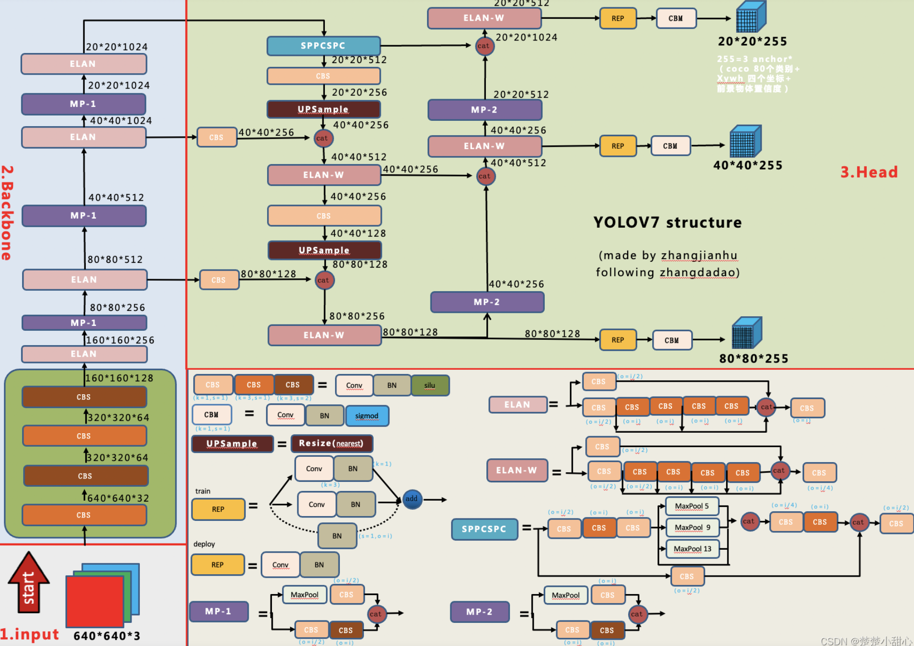</center>

## 2.改进点
#### 1.Model re-parametrization techniques(重参化技术)
**对应架构图当中的REP模块**。我们可通过[RepVGG: make VGG great again!](https://zhuanlan.zhihu.com/p/344324470)来快速理解什么为重参化技术。浅显地总结下：对于一个多分支block，可通过一定的方式将多分支合并为单分支，减少参数量同时提升效果。在RepVGG中，RepConv定义如下图，总结下就是一个3x3卷积 一个1x1卷积和一个恒等映射，可以压缩为一个单一的3x3卷积：
<center>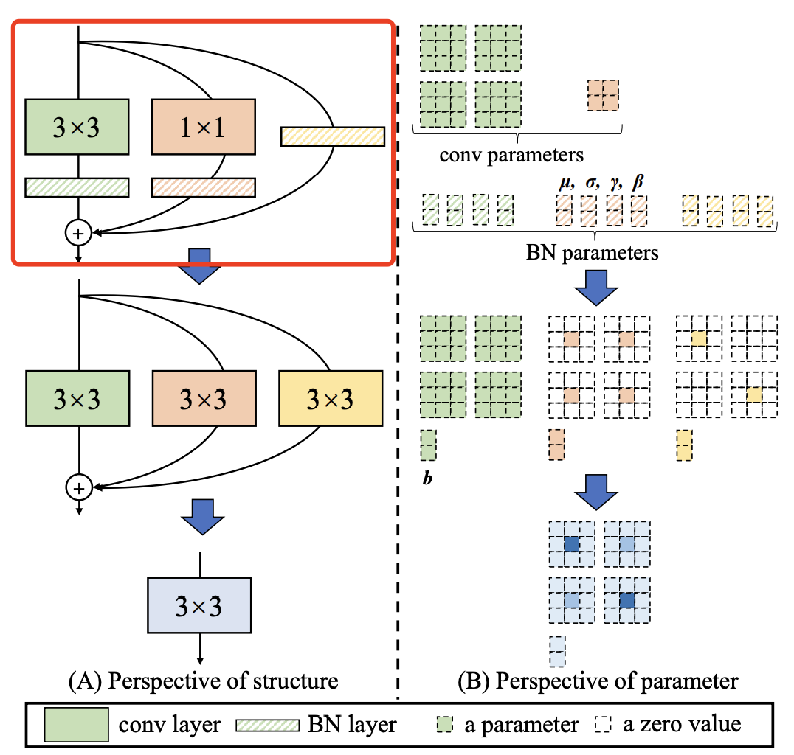</center>


#### 2.ELAN ELAN-W E-ELAN
对于ELAN，可通过下面这个博客进行了解：[理解Yolov7使用的ELAN](https://zhuanlan.zhihu.com/p/598642990)，目标是为了从梯度路径层面优化模型效果。 

ELAN-W模块，与ELAN所略有不同的是它在第二条分支的时候选取的输出数量不同。 

E-ELAN，其主要架构如下图所示。在大规模ELAN中，无论梯度路径长度和计算模块数量如何，都达到了稳定的状态。但如果更多计算模块被无限地堆叠，这种稳定状态可能会被破坏，参数利用率也会降低。本文提出的E-ELAN采用expand、shuffle、merge cardinality结构，实现在不破坏原始梯度路径的情况下，提高网络的学习能力。
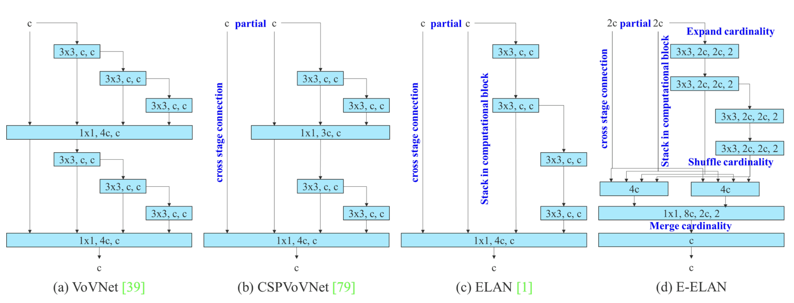

#### 3.Model scaling for concatenation-based models
模型缩放通过改变模型的宽度、深度和分辨率来生成不同大小的模型。
如果将上述E-EALN方法应用到基于级联的模型，我们会发现，当对深度放大或缩小时，基于级联的计算模块之后的过渡层的通道会随之减少或增加。如下图a->b所示。
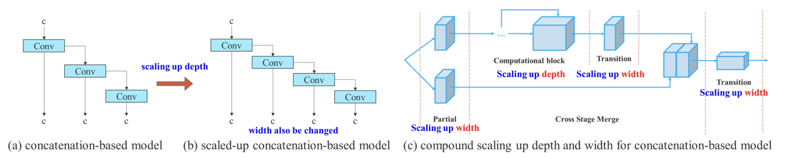
如果按比例放大深度，这种行为会导致过渡层的深入通道和输出通道的比例会变化，从而导致模型的硬件使用量下降。因此，对于基于级联的模型，必须提出一种复合模型缩放方法。即同时考虑深度因子以及过渡层的宽度因子。如上图(c)所示。

#### 4.辅助Loss及标签分配
辅助头（Aux head）指使用网络中间层进行损失计算来辅助网络训练（深度监督：监督网络不同深度特征）。如图（a）无辅助头。图（b）有辅助头。一般来说，在训练时增加辅助头可带来更好的性能，在推理时，去掉辅助头，加快模型推理速度。
本文作者将负责最终预测的head称为lead head，用于辅助训练的head称为aux head。用于训练两个head的样本分配策略如图（d）和（e）所示。
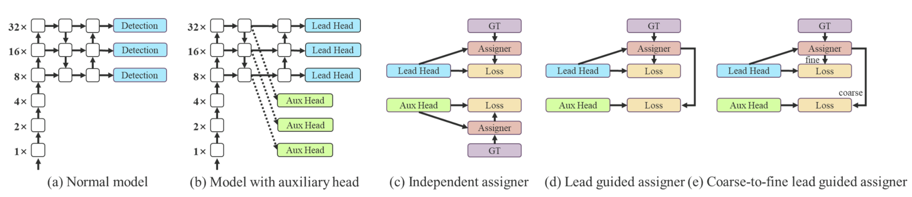
在过去，在深度网络的训练中，标签分配通常直接指的是ground truth，并根据给定的规则生成hard label（未经过softmax）。然而近年来，以目标检测为例，研究者经常利用网络预测的质量分布来结合ground truth，使用一些计算和优化方法来生成可靠的软标签（soft label）。例如，YOLO使用bounding box预测和ground truth的IoU作为软标签。在本文中，作者将网络预测结果与ground truth一起考虑后再分配软标签的机制称为“标签分配器”。无论辅助头或引导头，都需要对目标进行深度监督。那么，‘’如何为辅助头和引导头合理分配软标签？”，这是作者需要考虑的问题。目前最常用的方法如图5（c）所示，即将辅助头和引导头分离，然后利用它们各自的预测结果和ground truth执行标签分配。本文提出的方法是一种新的标签分配方法，通过引导头的预测来引导辅助头以及自身。换句话说，首先使用引导头的prediction作为指导，生成从粗到细的层次标签，分别用于辅助头和引导头的学习，具体可看图5(d)和(e)。 

**Lead head guided label assigner：** 引导头引导“标签分配器”预测结果和ground truth进行计算，并通过优化（在utils/loss.py的SigmoidBin(）函数中，传送门：`https://github.com/WongKinYiu/yolov7/blob/main/utils/loss.py` 生成软标签。这组软标签将作为辅助头和引导头的目标来训练模型。这样做的目的是使引导头具有较强的学习能力，由此产生的软标签更能代表源数据与目标之间的分布差异和相关性。此外，作者还可以将这种学习看作是一种广义上的余量学习。通过让较浅的辅助头直接学习引导头已经学习到的信息，引导头能更加专注于尚未学习到的残余信息。 

**Coarse-to-fine lead head guided label assigner：** Coarse-to-fine引导头使用到了自身的prediction和ground truth来生成软标签，引导标签进行分配。然而，在这个过程中，作者生成了两组不同的软标签，即粗标签和细标签，其中细标签与引导头在标签分配器上生成的软标签相同，粗标签是通过降低正样本分配的约束，允许更多的网格作为正目标（可以看下FastestDet的label assigner，不单单只把gt中心点所在的网格当成候选目标，还把附近的三个也算进行去，增加正样本候选框的数量）。原因是一个辅助头的学习能力并不需要强大的引导头，为了避免丢失信息，作者将专注于优化样本召回的辅助头。对于引导头的输出，可以从查准率中过滤出高精度值的结果作为最终输出。然而，值得注意的是，如果粗标签的附加权重接近细标签的附加权重，则可能会在最终预测时产生错误的先验结果。


## 3.实验
#### 消融实验
模型缩放：
<center>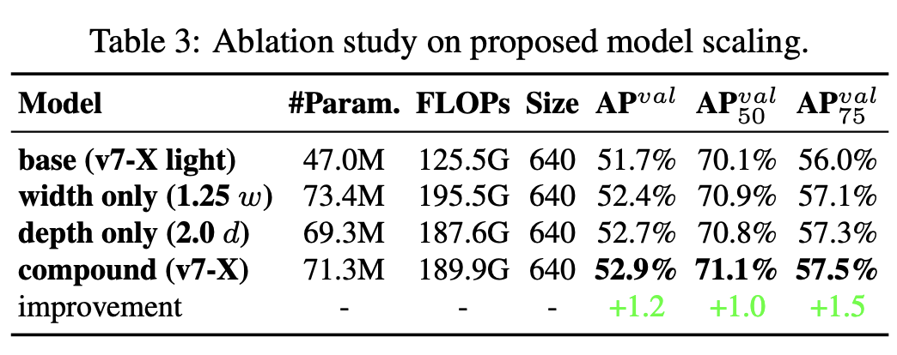</center> 

RepConv：
<center>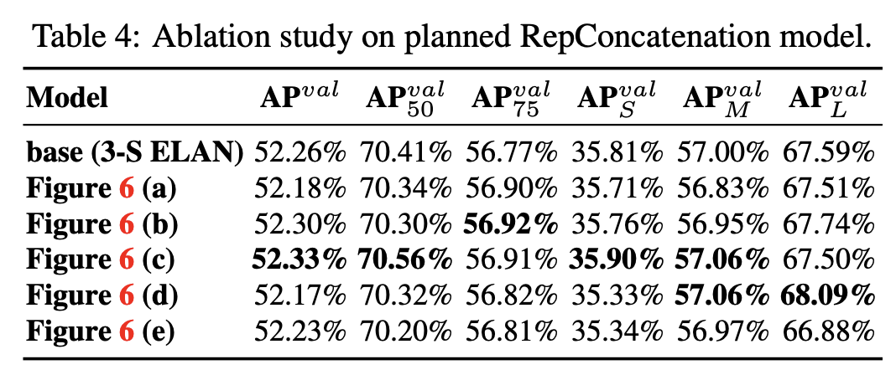</center> 

RepResidual：
<center>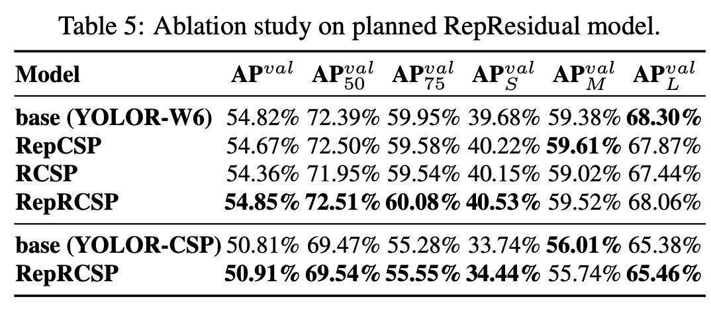</center> 

辅助头：
<center>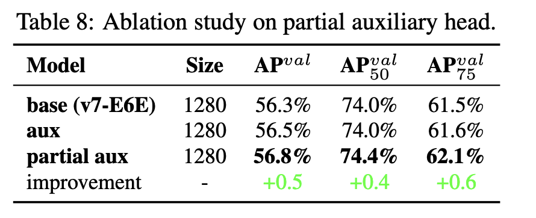</center>

#### baseline对比
<center>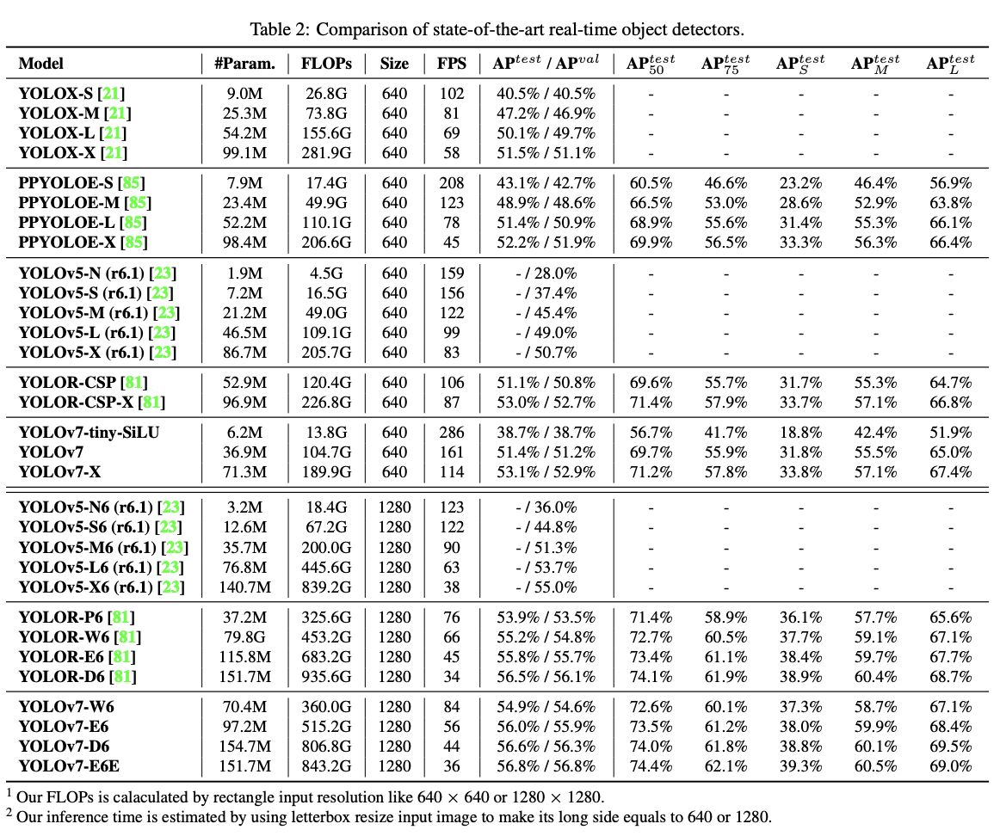</center>


## 4.训练
#### 1.数据集结构：
<center>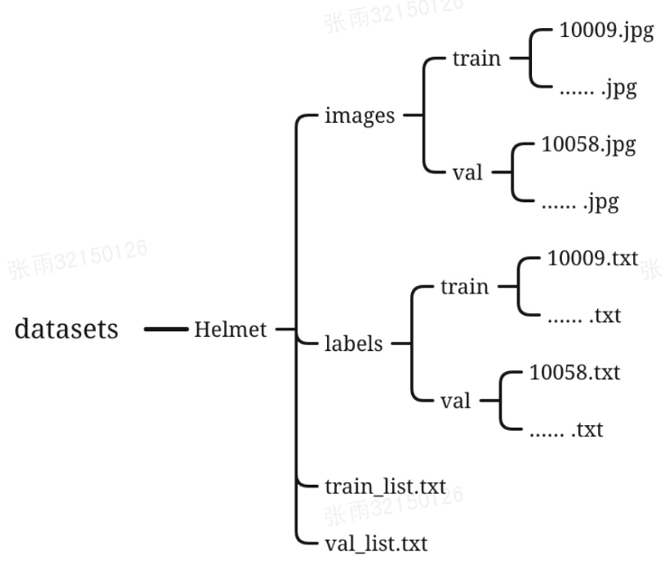</center>

#### 2.coco 数据集 格式
https://blog.csdn.net/weixin_44326452/article/details/122674257
x y w h定义：
```
def convert(size, box):
    dw = 1./(size[0])
    dh = 1./(size[1])
    x = (box[0] + box[1])/2.0 - 1
    y = (box[2] + box[3])/2.0 - 1
    w = box[1] - box[0]
    h = box[3] - box[2]
    x = x*dw
    w = w*dw
    y = y*dh
    h = h*dh
```
label文件txt内容格式：
```
category_id x y w h
category_id x y w h
category_id x y w h
...
```

#### 3.修改训练配置
总共有两个文件需要配置，一个是/yolov7/cfg/training/yolov7.yaml，这个文件是有关模型的配置文件；一个是/yolov7/data/coco.yaml，这个是数据集的配置文件。

-   修改/yolov7/cfg/training/yolov7.yaml
复制yolov7.yaml，并且重命名。此文件只需要修改一个地方，将nc的数量改为自定义数据集的class数量：
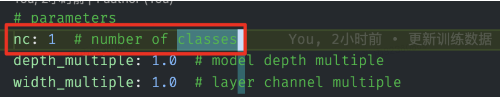
-   修改/yolov7/data/coco.yaml
同样复制coco.yaml，自定义重命名在相同目录。此文件需要修改多处，如下图所示：
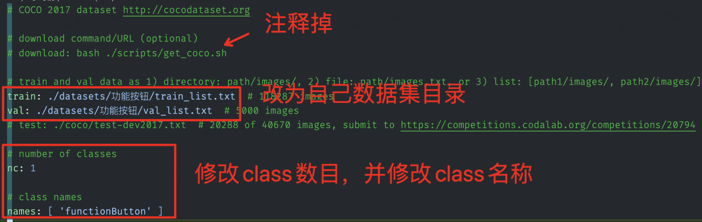
#### 4.训练
使用[yolov7_training.pt](https://github.com/WongKinYiu/yolov7/releases/download/v0.1/yolov7_training.pt)预训练模型(专门用于迁移的预训练模型)进行训练，这里设置batch_size为6 epoch为120：
```
python3 train.py --weights yolov7_training.pt --cfg cfg/training/yolov7-gnan.yaml --data data/gnan.yaml --device 0 --batch-size 6 --epoch 120
```
#### 5.查看结果
yolov7会自动生成完备的训练结果，在/runs/train/下。
<center>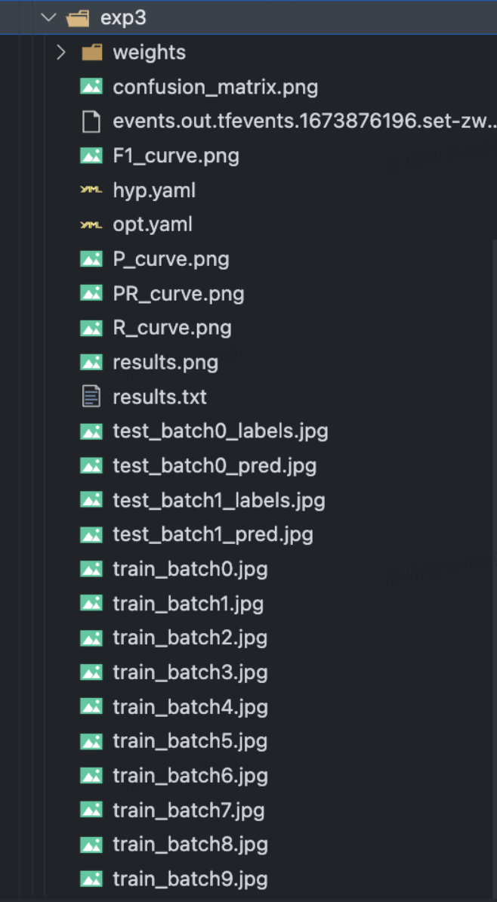</center>
<center>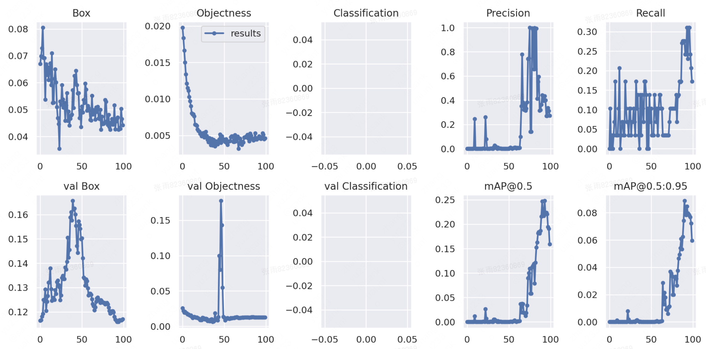</center>