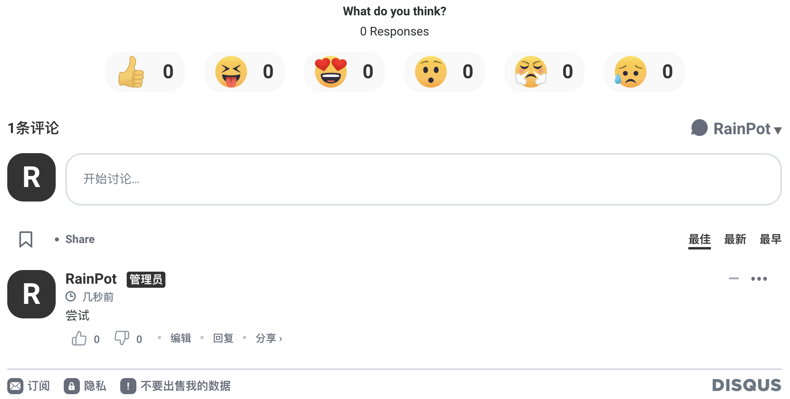

# disqus介绍

disqus官网：[https://help.disqus.com/en/](https://help.disqus.com/en/)

<center></center>

disqus是一个社区平台，通过disqus可以让你的网站拥有功能丰富评论系统，不少博客的评论区都使用disqus，让博主用户们通过disqus连结起来。disqus可以通过插入代码在网站上使用社区评论功能，并且可以自定义评论样式，查看评论数据等。

一个默认的样式如下：
<center></center>


# Hugo如何使用disqus

Hugo自身提供了内置模板，称为 [Internal Templates](https://gohugo.io/templates/internal/)。

一般的使用方法有以下几步：

### 1. 注册disqus

[注册页面](https://disqus.com/profile/signup/intent/) 

### 2. 开通留言板并获得disqus shortname

登陆disqus后，[Add new site](https://disqus.com/features/engage/) ：


<center></center>

在这里填写你自己定义的shortname，其他的按需填写即可：
<center></center>

服务页面选择免费方案即可。

一直点到最后一步Comlete Setup，自此你的disqus site就建立好了。此中最重要为shortname，这里一定要对应好。

在建立好后，还建议将自己的网页添加进disqus信任域名中：[add-to-trusted-domain](https://help.disqus.com/en/articles/1717206-how-to-use-trusted-domains)


### 3. 在主题的config.yaml或toml中添加你在disqus上注册的shortname
```
disqusShortname: your-disqus-shortname
```

### 4. 在主题模板文件中添加disqus代码。 

在`layouts/partials/`目录下新建`layouts/partials/disqus.html`，并添加代码:
```
<div id="disqus_thread"></div>
<script type="text/javascript">

(function() {
    // Don't ever inject Disqus on localhost--it creates unwanted
    // discussions from 'localhost:1313' on your Disqus account...
    if (window.location.hostname == "localhost")
        return;

    var dsq = document.createElement('script'); dsq.type = 'text/javascript'; dsq.async = true;
    var disqus_shortname = '{{ .Site.DisqusShortname }}';
    dsq.src = '//' + disqus_shortname + '.disqus.com/embed.js';
    (document.getElementsByTagName('head')[0] || document.getElementsByTagName('body')[0]).appendChild(dsq);
})();
</script>
<noscript>Please enable JavaScript to view the <a href="https://disqus.com/?ref_noscript">comments powered by Disqus.</a></noscript>
<a href="https://disqus.com/" class="dsq-brlink">comments powered by <span class="logo-disqus">Disqus</span></a>
```

在你的网站的任意位置加入以下模板代码即可：
```
{{ partial "disqus.html" . }}
```
比如我会在`layouts/blog/single.html`(主题单个博客模板html)的footer前面添加以上代码。

# 可能遇到的问题
1.在hugo本地调试时，disqus加载不出来，但上线后在blog中可以显示

2.disqus在国内被墙了，可能需要翻墙