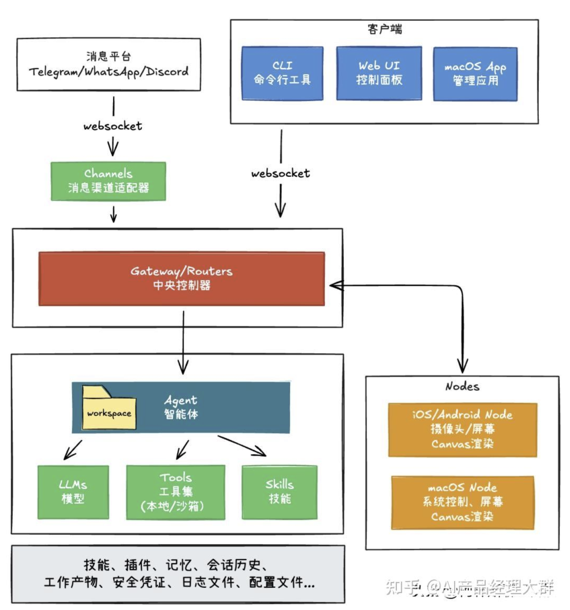
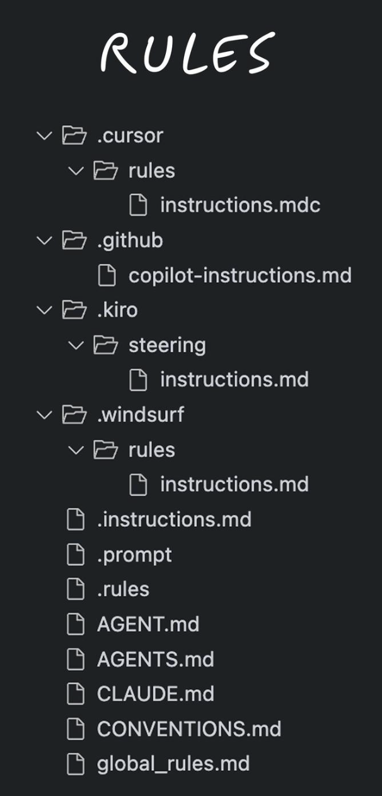
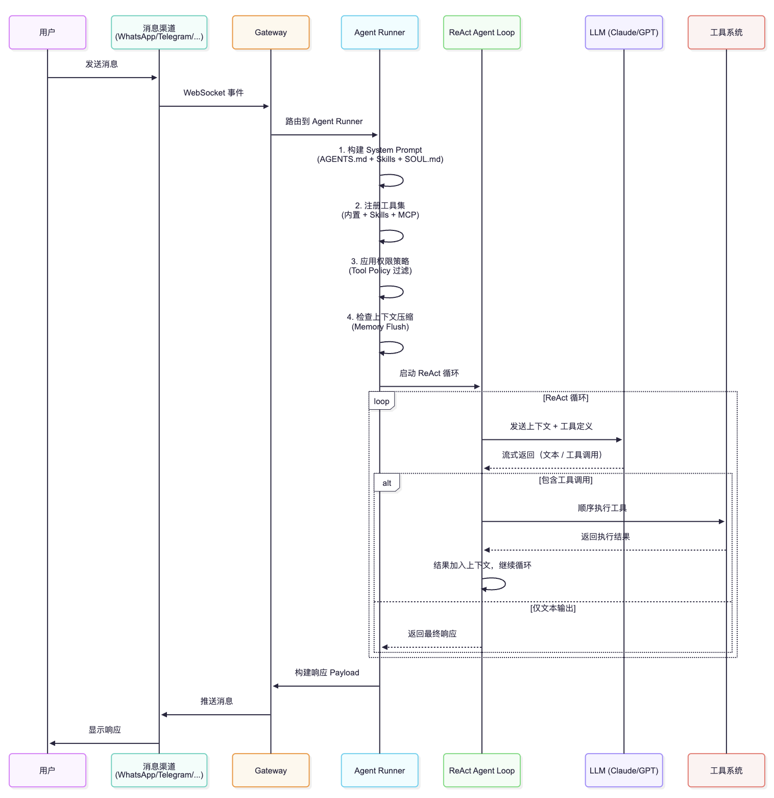

## 目录
1. OpenClaw 项目简介
2. 项目架构概览
3. AI Agents 能力相关概念介绍
   - 3.1 Agent / Rules / Tools / Skills / MCP 总览
   - 3.2 Rules/Spec — 公司规章制度与 SOP
   - 3.3 Tool Call — 员工操作软件的具体动作
   - 3.4 MCP
   - 3.5 Skills — 员工的简历与才艺
4. AI Agent 主流架构模式
5. OpenClaw 的 Agent 执行流程
   - 5.1 整体架构：增强型 ReAct + pi-mono 底座
   - 5.2 pi-mono 引擎：分层设计
   - 5.3 Agent 执行全流程：从消息到响应
   - 5.4 ReAct 工程增强
   - 5.5 记忆系统：让 Agent 拥有长期记忆
   - 5.6 架构选型思考
6. 总结与展望
---

## 1. OpenClaw 项目简介

### 1.1 什么是 OpenClaw？

**OpenClaw** 是一个开源的、可自托管的**个人 AI 助手系统**，它的核心理念是：

- 🏠 **本地优先**：在你自己的设备上运行，并启动网关服务处理所有渠道的消息请求
- 📱 **多渠道接入**：支持 WhatsApp、Telegram、Slack、Discord、Signal、iMessage、hi 等多个消息平台
- 🧠 **智能代理**：集成多个主流 AI 模型（Claude、GPT 等）
- 🛠️ **工具生态**：通过 Skills 和 Tools 本地执行各类工具命令，实现用户在电脑上的各类操作需求


### 1.2 与已有的助手有什么区别？

OpenClaw 和 Cowork/Manus 等 Agent 产品的核心区别有五点：

| 对比维度           | Manus/Claude Cowork 等通用 Agent 产品  | OpenClaw                                     |
| -------------- | --------------------------------- | -------------------------------------------- |
| **交互入口**       | 以 CLI、Web、桌面 App 作为入口             | 以 IM 作为核心入口，主要在手机上使用                         |
| **交互方式**       | 用户→Agent 的单向交互（用户下发任务，Agent 完成任务） | 双向交互，Agent 可以根据 Cron、Heartbeat 机制主动执行任务和联系用户 |
| **Agent 生命周期** | 按需启动                              | 7×24h 全天在线                                   |
| **Agent 运行环境** | 分散的或一次性的                          | 持久的工作区和运行环境                                  |
| **自我进化**       | 能力固定，需要用户主动扩展                     | 可以自我进化，通过技能系统和插件动态增强能力                       |

### 1.3 核心流程


#### Gateway：OpenClaw 的中央神经系统

在上面的核心流程图中，所有消息渠道和客户端都通过 **Gateway** 这个中心节点交互。Gateway 是 OpenClaw 最核心的基础设施组件，可以把它理解为公司的**前台总机 + 门禁系统 + 广播站**：

- **前台总机**：所有来电（消息）都先到前台，前台决定转给谁
- **门禁系统**：验证来访者身份，控制谁能进入、能做什么
- **广播站**：有重要事件时，向全公司实时广播

它本质上是一个 **WebSocket 服务器**，默认监听 `ws://127.0.0.1:18789`，所有消息渠道和客户端都通过它与系统交互。

##### Gateway 的六大职责

| 职责          | 公司隐喻       | 说明                                    |
| ----------- | ---------- | ------------------------------------- |
| **多渠道消息聚合** | 前台接听所有电话线路 | 统一接收来自 WhatsApp、Telegram、Slack 等渠道的消息 |
| **消息路由**    | 前台转接电话     | 将消息智能路由到 Agent 进行处理                   |
| **认证与权限控制** | 门禁刷卡       | 多层认证（Token、密码、设备身份）+ 细粒度授权            |
| **会话管理**    | 会议室预约系统    | 创建/管理用户会话、跟踪聊天历史                      |
| **事件广播**    | 公司广播站      | 实时推送 Agent 事件给所有连接的客户端                |
| **资源协调**    | 行政总务       | 启停渠道、调度定时任务、管理远程节点                    |


##### 消息路由全流程

以一条 WhatsApp 消息为例，看看它如何从用户手机到达 Agent，再返回给用户：

```
┌─ 用户在 WhatsApp 发送"帮我查看天气" ─────────────────────────────────┐
│                                                                     │
│  ① WhatsApp 渠道接收消息                                              │
│     Baileys SDK 拿到用户消息                                          │
│         │                                                           │
│         ▼                                                           │
│  ② 渠道调用 Gateway 方法                                              │
│     chat.send({                                                     │
│       sessionKey: "whatsapp:user123",                               │
│       message: "帮我查看天气"                                         │
│     })                                                              │
│         │                                                           │
│         ▼                                                           │
│  ③ Gateway 验证权限 + 获取/创建会话                                    │
│         │                                                           │
│         ▼                                                           │
│  ④ 触发 Agent Runner 执行                                            │
│     构建 System Prompt → 组装工具 → 启动 ReAct 循环                    │
│         │                                                           │
│         ▼                                                           │
│  ⑤ Agent 执行过程中，Gateway 实时广播事件                               │
│     → agent.started（Agent 开始工作）                                  │
│     → agent.event（思考中...）                                        │
│     → agent.event（调用 weather 工具）                                 │
│     → agent.completed（任务完成）                                      │
│     所有连接的客户端（CLI、Web UI、App）都能看到实时进度                   │
│         │                                                           │
│         ▼                                                           │
│  ⑥ WhatsApp 渠道接收 agent.completed 事件                              │
│     调用 send({ to: "user123", message: "今天晴天，25°C" })            │
│         │                                                           │
│         ▼                                                           │
│  ⑦ 用户在 WhatsApp 上看到回复                                         │
│                                                                     │
└─────────────────────────────────────────────────────────────────────┘
```

##### Gateway 支持的方法一览

Gateway 暴露了丰富的 RPC 方法，按功能域分组：

| 功能域 | 方法 | 说明 |
|--------|------|------|
| **Agent** | `agent`, `agent.wait`, `agents.list`, `agents.create` | 执行 Agent、管理 Agent 实例 |
| **聊天** | `chat.send`, `chat.abort`, `chat.history`, `chat.inject` | 发送消息、中止执行、查看历史 |
| **渠道** | `channels.status`, `channels.logout` | 渠道状态管理 |
| **会话** | `sessions.list`, `sessions.patch`, `sessions.reset`, `sessions.delete` | 会话 CRUD |
| **节点** | `node.list`, `node.invoke`, `node.pair.request` | 远程节点管理 |
| **定时任务** | `cron.list`, `cron.create`, `cron.delete` | 定时任务管理 |
| **配置** | `config.get`, `config.patch` | 运行时配置管理 |
| **系统** | `health`, `status` | 健康检查和系统状态 |

##### HTTP 端点

除了核心的 WebSocket 协议，Gateway 同时暴露了若干 HTTP 端点：

| 端点 | 用途 |
|------|------|
| `/` | WebSocket 连接升级入口 |
| `/control/` | Web 控制面板 UI |
| `/v1/chat/completions` | **OpenAI 兼容 API**（可以像调用 OpenAI 一样调用 OpenClaw） |
| `/v1/responses` | OpenResponses 标准 API |
| `/hooks/` | 接收外部 Webhook 回调 |
| `/canvas/` | Canvas 画布服务 |

其中 **OpenAI 兼容 API** 是一个非常巧妙的设计——它让任何支持 OpenAI API 格式的客户端都可以直接接入 OpenClaw 的 Gateway。

##### 启动方式

Gateway 通过 CLI 命令启动：

```bash
openclaw gateway run [options]

# 常用选项
  --port <port>          # 端口，默认 18789
  --bind <mode>          # 绑定模式：loopback（仅本地）| lan（局域网）| tailnet（Tailscale）
  --auth <mode>          # 认证模式：token | password
  --token <token>        # 认证 Token
  --force                # 强制释放端口
```

启动后，Gateway 会依次完成：加载配置 → 创建 HTTP/HTTPS 服务器 → 启动 WebSocket 服务 → 初始化消息渠道 → 启动定时任务调度 → 启用 mDNS/Bonjour 局域网服务发现 → 进入运行循环。

##### 一句话总结

> **Gateway 是 OpenClaw 的中央神经系统**：它通过 WebSocket + JSON-RPC 协议，将多个消息渠道、多种客户端、AI Agent 引擎、定时任务和远程节点连接在一起，并在此过程中实施认证授权、会话管理和事件广播，是整个系统 7×24h 运行的核心枢纽。

---

## 2. 项目架构概览

### 2.1 目录结构

```
openclaw/
├── src/                      # 核心源码
│   ├── agents/              # Agent 运行时核心
│   │   ├── pi-tools.ts      # 工具注册与权限控制
│   │   ├── bash-tools.ts    # 命令执行工具
│   │   └── sandbox.js       # 沙箱隔离
│   ├── auto-reply/          # 自动回复与 Agent 执行
│   │   └── reply/
│   │       ├── agent-runner.ts          # Agent 执行主流程
│   │       ├── agent-runner-execution.ts # 执行逻辑
│   │       └── agent-runner-payloads.ts  # 响应构建
│   ├── channels/            # 各消息渠道集成
│   └── gateway/             # WebSocket Gateway
├── skills/                   # 技能定义目录
│   ├── github/              # GitHub 集成
│   ├── 1password/           # 1Password 集成
│   └── ...                  # 50+ 内置技能
├── docs/                     # 完整文档
├── apps/                     # 平台应用
│   ├── macos/               # macOS 菜单栏应用
│   ├── ios/                 # iOS 节点应用
│   └── android/             # Android 节点应用
└── AGENTS.md                # Agent 行为规范文档
```

### 2.2 技术栈

| 层级 | 技术选型 |
|------|---------|
| **运行时** | Node.js 22+ / TypeScript (ESM) |
| **Agent 引擎** | [@mariozechner/pi-mono](https://github.com/badlogic/pi-mono) |
| **消息通道** | Baileys (WhatsApp), grammY (Telegram), discord.js, Slack Bolt |
| **前端** | React (Web UI), SwiftUI (macOS/iOS), Kotlin (Android) |
| **构建工具** | pnpm, Bun (开发), Vitest (测试) |
| **协议** | WebSocket, JSON-RPC |

---

## 3. AI Agents 能力相关概念介绍

> **前言：用"一家公司"来理解 AI Agent 系统**
>
> 在深入技术细节之前，我们先建立一个直观的隐喻——把整个 AI Agent 系统想象成**一家公司**：

| 技术概念             | 公司隐喻                 | 一句话解释                        |
| ---------------- | -------------------- | ---------------------------- |
| **Agent**        | 👤 员工                | 公司里负责完成具体工作的人                |
| **Skills**       | 📋 员工的简历 / 才艺        | 员工"会什么"——掌握的专业知识和操作技能        |
| **Tools**        | 🔧 公司内部设备            | 公司内部维护的员工工具                  |
| **Tool Call**    | ✋ 使用软件的具体动作          | 打开 Excel → 选中 A1 → 输入数据 → 保存 |
| **Rules / Spec** | 📖 公司规章制度 / SOP / JD | 员工必须遵守的规章、标准作业流程、岗位职责        |
| **MCP**          | 🔌 公司外部设备            | 公司外部设备，黑盒模式完成部分任务            |


---

### 3.1 Agent / Rules / Tools / Skills / MCP 总览

```
              📖 Rules/Spec（公司规章制度 / SOP / JD）
              ════════════════════════════════════════
              AGENTS.md + Tool Policies + Runtime Permissions
              ─────────── 约束以下所有行为 ───────────
                                │
                                ▼
┌───────────────────────────────────────────────────────────────┐
│                                                               │
│    ┌─────────────┐    ┌─────────────┐    ┌─────────────┐     │
│    │ 🔧 内置工具   │    │ 📋 Skills    │    │ 🔌 MCP      │     │
│    │ (Excel/打印)  │    │ (简历/才艺)   │    │ (USB外接)    │     │
│    └──────┬──────┘    └──────┬──────┘    └──────┬──────┘     │
│           │                  │                  │            │
│           └──────────────────┼──────────────────┘            │
│                              │                               │
│                   ❶ 工具清单注入（下发）                       │
│                    Tool Definitions /                        │
│                    Skill Descriptions /                      │
│                    MCP Tool Schemas                          │
│                   "今天你能用这些设备"                         │
│                              │                               │
│                              ▼                               │
│    ┌─────────────────────────────────────────────────────┐   │
│    │              👤 Agent（员工）的大脑                    │   │
│    │           AI 模型 (Claude/GPT/Gemini)                │   │
│    │                                                      │   │
│    │    ┌────────────┐ ┌────────────┐ ┌──────────┐       │   │
│    │    │System Prompt│ │Tool Schemas│ │ 用户消息  │       │   │
│    │    │ (员工手册)  │ │(设备说明书) │ │(客户需求) │       │   │
│    │    └────────────┘ └────────────┘ └──────────┘       │   │
│    │                                                      │   │
│    │    思考："客户要查天气，我有 weather 工具"              │   │
│    │        → 输出 function_call 请求                     │   │
│    └─────────────────────────┬───────────────────────────┘   │
│                              │                               │
│                   ❷ 实际调用 (function_call)                  │
│                              │                               │
│                              ▼                               │
│    ┌─────────────────────────────────────────────────────┐   │
│    │           ✋ Tool Call 转换层（"行政助理"）             │   │
│    │      把指令翻译成不同品牌工具能理解的格式               │   │
│    │      • Anthropic → tool_use                         │   │
│    │      • OpenAI    → function                         │   │
│    │      • Gemini    → functionCall                     │   │
│    └──────────┬──────────────┬──────────────┬────────────┘   │
│               │              │              │                │
│               ▼              ▼              ▼                │
│          🔧 内置工具    📋 Skill 执行   🔌 MCP Server        │
│          (直接执行)    (子流程/脚本)   (JSON-RPC 调用)        │
│               │              │              │                │
│               └──────────────┼──────────────┘                │
│                              │                               │
│                              ▼                               │
│                       📤 Tool Result                         │
│                    (执行结果回传给 Agent,                     │
│                     进入下一轮思考循环)                       │
│                              │                               │
│                              └─────→ 回到 👤 Agent ↑         │
│                                                               │
└───────────────────────────────────────────────────────────────┘

```

#### 三大"工具来源"对比

| 维度       | 🔧 内置工具（公司自有设备）             | 📋 Skills（员工简历/才艺）        | 🔌 MCP（公司外部设备）       |
| -------- | --------------------------- | ------------------------- | -------------------- |
| **公司隐喻** | 公司统一采购的电脑、打印机               | 员工自带的专业知识和技能              | 通过 标准协议即插即用的外设       |
| **本质**   | 代码中定义的函数                    | System Prompt 超级提示词       | 标准化工具通信协议            |
| **工作方式** | 直接函数调用                      | 指导 Agent 组合已有工具           | 通过 RPC 调用远程服务        |
| **执行位置** | 本地进程内                       | Agent 自身（本地进程内）           | MCP Server 侧（可本地/远程） |
| **定义方式** | TypeScript 函数 + JSON Schema | SKILL.md Markdown 文件 + 代码 | MCP Server 声明        |
| **延迟**   | 低（手边直接用）                    | 低（脑子里的知识）                 | 中~高（跨进程/网络）          |
| **典型场景** | read/write/exec/browser     | GitHub 操作指导、1Password 使用  | 数据库查询、第三方 API        |


---

### 3.2 Rules/Spec — 公司规章制度与 SOP

> **公司隐喻**：任何公司要正常运转，首先需要**规章制度**（员工手册、行为准则）、**SOP（标准作业程序）**和**JD（职位描述）**。新员工入职第一天，先通读《员工手册》，知道什么能做、什么不能做、做事的标准流程是什么。
>
> 在 OpenClaw 中，Agent（员工）的行为规范体系就是这套"公司制度"。

#### 3.2.1 三层制度体系

就像一家成熟企业的管理制度分层一样，OpenClaw 的规范也分为三个层级：

```
┌─────────────────────────────────────────────────────────┐
│  Layer 1: AGENTS.md —— "员工手册"                        │
│  公司宪法级文件，所有员工入职必读                            │
│  （注入到 System Prompt，指导 Agent 理解项目规范）           │
└──────────────────────┬──────────────────────────────────┘
                       │
                       ▼
┌─────────────────────────────────────────────────────────┐
│  Layer 2: Tool Policies —— "部门权限制度"                  │
│  不同岗位/部门能使用哪些软件和设备                            │
│  （通过 JSON 配置控制工具权限和执行行为）                     │
└──────────────────────┬──────────────────────────────────┘
                       │
                       ▼
┌─────────────────────────────────────────────────────────┐
│  Layer 3: Runtime Permissions —— "现场审批单"               │
│  员工遇到敏感操作时，需要找主管当场签字审批                     │
│  （动态请求用户授权，细粒度控制敏感操作）                      │
└─────────────────────────────────────────────────────────┘
```

---

#### 3.2.2 Layer 1: AGENTS.md —— "员工手册"

##### 什么是 AGENTS.md？

[`AGENTS.md`](AGENTS.md) 是 OpenClaw 的 **"公司员工手册"**，它是一个特殊的 Markdown 文件，相当于**公司的宪法级文件**，包含了：

- 📖 **公司制度**（代码仓库规范）：公司的组织架构、部门划分、命名约定、工作流程
- 🧑‍💻 **岗位 SOP**（开发者指引）：如何构建、测试、发布——每项工作的标准操作步骤
- 🤖 **行为红线**（Agent 行为规则）：员工在操作代码时绝对不能触碰的底线

**类比理解：**
- **新员工**（Agent）上班第一天 → 人力资源部发放《员工手册》
- **Agent 初始化时** → 系统将 AGENTS.md 注入到 System Prompt（"把手册读进脑子里"）
- 之后员工的所有行为都必须遵守手册规定

AGENTS.md 其实就是给 Agent 规定的 Rules。为什么需要 AGENTS.md？当前不同 AI Coding 工具有不同的 rules 读取规则，导致 Rules 碎片化，难以维护：


所以 OpenAI 联合 Google、Cursor 等，推出了一个简单的新标准，用一个清晰、统一的文档，取代厂家特定的配置文件，为 AI 编程 Agent 提供一种可预测的方式来理解和操作软件项目。

##### 示例：openclaw的AGENTS.md

```markdown
# Repository Guidelines

- Repo: https://github.com/openclaw/openclaw
- GitHub issues/comments/PR comments: use literal multiline strings or `-F - <<'EOF'` (or $'...') for real newlines; never embed "\\n".

## Project Structure & Module Organization

- Source code: `src/` (CLI wiring in `src/cli`, commands in `src/commands`, web provider in `src/provider-web.ts`, infra in `src/infra`, media pipeline in `src/media`).
- Tests: colocated `*.test.ts`.
- Docs: `docs/` (images, queue, Pi config). Built output lives in `dist/`.
- Plugins/extensions: live under `extensions/*` (workspace packages). Keep plugin-only deps in the extension `package.json`; do not add them to the root `package.json` unless core uses them.
- Plugins: install runs `npm install --omit=dev` in plugin dir; runtime deps must live in `dependencies`. Avoid `workspace:*` in `dependencies` (npm install breaks); put `openclaw` in `devDependencies` or `peerDependencies` instead (runtime resolves `openclaw/plugin-sdk` via jiti alias).
- Installers served from `https://openclaw.ai/*`: live in the sibling repo `../openclaw.ai` (`public/install.sh`, `public/install-cli.sh`, `public/install.ps1`).
- Messaging channels: always consider **all** built-in + extension channels when refactoring shared logic (routing, allowlists, pairing, command gating, onboarding, docs).
  - Core channel docs: `docs/channels/`
  - Core channel code: `src/telegram`, `src/discord`, `src/slack`, `src/signal`, `src/imessage`, `src/web` (WhatsApp web), `src/channels`, `src/routing`
  - Extensions (channel plugins): `extensions/*` (e.g. `extensions/msteams`, `extensions/matrix`, `extensions/zalo`, `extensions/zalouser`, `extensions/voice-call`)
- When adding channels/extensions/apps/docs, update `.github/labeler.yml` and create matching GitHub labels (use existing channel/extension label colors).

## Docs Linking (Mintlify)

- Docs are hosted on Mintlify (docs.openclaw.ai).
- Internal doc links in `docs/**/*.md`: root-relative, no `.md`/`.mdx` (example: `[Config](/configuration)`).
- When working with documentation, read the mintlify skill.
- Section cross-references: use anchors on root-relative paths (example: `[Hooks](/configuration#hooks)`).
- Doc headings and anchors: avoid em dashes and apostrophes in headings because they break Mintlify anchor links.
- When Peter asks for links, reply with full `https://docs.openclaw.ai/...` URLs (not root-relative).
- When you touch docs, end the reply with the `https://docs.openclaw.ai/...` URLs you referenced.
- README (GitHub): keep absolute docs URLs (`https://docs.openclaw.ai/...`) so links work on GitHub.
- Docs content must be generic: no personal device names/hostnames/paths; use placeholders like `user@gateway-host` and “gateway host”.

## Docs i18n (zh-CN)

- `docs/zh-CN/**` is generated; do not edit unless the user explicitly asks.
- Pipeline: update English docs → adjust glossary (`docs/.i18n/glossary.zh-CN.json`) → run `scripts/docs-i18n` → apply targeted fixes only if instructed.
- Translation memory: `docs/.i18n/zh-CN.tm.jsonl` (generated).
- See `docs/.i18n/README.md`.
- The pipeline can be slow/inefficient; if it’s dragging, ping @jospalmbier on Discord instead of hacking around it.

## exe.dev VM ops (general)

- Access: stable path is `ssh exe.dev` then `ssh vm-name` (assume SSH key already set).
- SSH flaky: use exe.dev web terminal or Shelley (web agent); keep a tmux session for long ops.
- Update: `sudo npm i -g openclaw@latest` (global install needs root on `/usr/lib/node_modules`).
- Config: use `openclaw config set ...`; ensure `gateway.mode=local` is set.
- Discord: store raw token only (no `DISCORD_BOT_TOKEN=` prefix).
- Restart: stop old gateway and run:
  `pkill -9 -f openclaw-gateway || true; nohup openclaw gateway run --bind loopback --port 18789 --force > /tmp/openclaw-gateway.log 2>&1 &`
- Verify: `openclaw channels status --probe`, `ss -ltnp | rg 18789`, `tail -n 120 /tmp/openclaw-gateway.log`.

## Build, Test, and Development Commands

- Runtime baseline: Node **22+** (keep Node + Bun paths working).
- Install deps: `pnpm install`
- Pre-commit hooks: `prek install` (runs same checks as CI)
- Also supported: `bun install` (keep `pnpm-lock.yaml` + Bun patching in sync when touching deps/patches).
- Prefer Bun for TypeScript execution (scripts, dev, tests): `bun <file.ts>` / `bunx <tool>`.
- Run CLI in dev: `pnpm openclaw ...` (bun) or `pnpm dev`.
- Node remains supported for running built output (`dist/*`) and production installs.
- Mac packaging (dev): `scripts/package-mac-app.sh` defaults to current arch. Release checklist: `docs/platforms/mac/release.md`.
- Type-check/build: `pnpm build`
- TypeScript checks: `pnpm tsgo`
- Lint/format: `pnpm check`
- Format check: `pnpm format` (oxfmt --check)
- Format fix: `pnpm format:fix` (oxfmt --write)
- Tests: `pnpm test` (vitest); coverage: `pnpm test:coverage`

## Coding Style & Naming Conventions

- Language: TypeScript (ESM). Prefer strict typing; avoid `any`.
- Formatting/linting via Oxlint and Oxfmt; run `pnpm check` before commits.
- Add brief code comments for tricky or non-obvious logic.
- Keep files concise; extract helpers instead of “V2” copies. Use existing patterns for CLI options and dependency injection via `createDefaultDeps`.
- Aim to keep files under ~700 LOC; guideline only (not a hard guardrail). Split/refactor when it improves clarity or testability.
- Naming: use **OpenClaw** for product/app/docs headings; use `openclaw` for CLI command, package/binary, paths, and config keys.

## Release Channels (Naming)

- stable: tagged releases only (e.g. `vYYYY.M.D`), npm dist-tag `latest`.
- beta: prerelease tags `vYYYY.M.D-beta.N`, npm dist-tag `beta` (may ship without macOS app).
- dev: moving head on `main` (no tag; git checkout main).

## Testing Guidelines

- Framework: Vitest with V8 coverage thresholds (70% lines/branches/functions/statements).
- Naming: match source names with `*.test.ts`; e2e in `*.e2e.test.ts`.
- Run `pnpm test` (or `pnpm test:coverage`) before pushing when you touch logic.
- Do not set test workers above 16; tried already.
- Live tests (real keys): `CLAWDBOT_LIVE_TEST=1 pnpm test:live` (OpenClaw-only) or `LIVE=1 pnpm test:live` (includes provider live tests). Docker: `pnpm test:docker:live-models`, `pnpm test:docker:live-gateway`. Onboarding Docker E2E: `pnpm test:docker:onboard`.
- Full kit + what’s covered: `docs/testing.md`.
- Changelog: user-facing changes only; no internal/meta notes (version alignment, appcast reminders, release process).
- Pure test additions/fixes generally do **not** need a changelog entry unless they alter user-facing behavior or the user asks for one.
- Mobile: before using a simulator, check for connected real devices (iOS + Android) and prefer them when available.

## Commit & Pull Request Guidelines

**Full maintainer PR workflow (optional):** If you want the repo's end-to-end maintainer workflow (triage order, quality bar, rebase rules, commit/changelog conventions, co-contributor policy, and the `review-pr` > `prepare-pr` > `merge-pr` pipeline), see `.agents/skills/PR_WORKFLOW.md`. Maintainers may use other workflows; when a maintainer specifies a workflow, follow that. If no workflow is specified, default to PR_WORKFLOW.

- Create commits with `scripts/committer "<msg>" <file...>`; avoid manual `git add`/`git commit` so staging stays scoped.
- Follow concise, action-oriented commit messages (e.g., `CLI: add verbose flag to send`).
- Group related changes; avoid bundling unrelated refactors.
- Read this when submitting a PR: `docs/help/submitting-a-pr.md` ([Submitting a PR](https://docs.openclaw.ai/help/submitting-a-pr))
- Read this when submitting an issue: `docs/help/submitting-an-issue.md` ([Submitting an Issue](https://docs.openclaw.ai/help/submitting-an-issue))

## Shorthand Commands

- `sync`: if working tree is dirty, commit all changes (pick a sensible Conventional Commit message), then `git pull --rebase`; if rebase conflicts and cannot resolve, stop; otherwise `git push`.

## Security & Configuration Tips

- Web provider stores creds at `~/.openclaw/credentials/`; rerun `openclaw login` if logged out.
- Pi sessions live under `~/.openclaw/sessions/` by default; the base directory is not configurable.
- Environment variables: see `~/.profile`.
- Never commit or publish real phone numbers, videos, or live configuration values. Use obviously fake placeholders in docs, tests, and examples.
- Release flow: always read `docs/reference/RELEASING.md` and `docs/platforms/mac/release.md` before any release work; do not ask routine questions once those docs answer them.

## Troubleshooting

- Rebrand/migration issues or legacy config/service warnings: run `openclaw doctor` (see `docs/gateway/doctor.md`).

## Agent-Specific Notes

- Vocabulary: "makeup" = "mac app".
- Never edit `node_modules` (global/Homebrew/npm/git installs too). Updates overwrite. Skill notes go in `tools.md` or `AGENTS.md`.
- When adding a new `AGENTS.md` anywhere in the repo, also add a `CLAUDE.md` symlink pointing to it (example: `ln -s AGENTS.md CLAUDE.md`).
- Signal: "update fly" => `fly ssh console -a flawd-bot -C "bash -lc 'cd /data/clawd/openclaw && git pull --rebase origin main'"` then `fly machines restart e825232f34d058 -a flawd-bot`.
- When working on a GitHub Issue or PR, print the full URL at the end of the task.
- When answering questions, respond with high-confidence answers only: verify in code; do not guess.
- Never update the Carbon dependency.
- Any dependency with `pnpm.patchedDependencies` must use an exact version (no `^`/`~`).
- Patching dependencies (pnpm patches, overrides, or vendored changes) requires explicit approval; do not do this by default.
- CLI progress: use `src/cli/progress.ts` (`osc-progress` + `@clack/prompts` spinner); don’t hand-roll spinners/bars.
- Status output: keep tables + ANSI-safe wrapping (`src/terminal/table.ts`); `status --all` = read-only/pasteable, `status --deep` = probes.
- Gateway currently runs only as the menubar app; there is no separate LaunchAgent/helper label installed. Restart via the OpenClaw Mac app or `scripts/restart-mac.sh`; to verify/kill use `launchctl print gui/$UID | grep openclaw` rather than assuming a fixed label. **When debugging on macOS, start/stop the gateway via the app, not ad-hoc tmux sessions; kill any temporary tunnels before handoff.**
- macOS logs: use `./scripts/clawlog.sh` to query unified logs for the OpenClaw subsystem; it supports follow/tail/category filters and expects passwordless sudo for `/usr/bin/log`.
- If shared guardrails are available locally, review them; otherwise follow this repo's guidance.
- SwiftUI state management (iOS/macOS): prefer the `Observation` framework (`@Observable`, `@Bindable`) over `ObservableObject`/`@StateObject`; don’t introduce new `ObservableObject` unless required for compatibility, and migrate existing usages when touching related code.
- Connection providers: when adding a new connection, update every UI surface and docs (macOS app, web UI, mobile if applicable, onboarding/overview docs) and add matching status + configuration forms so provider lists and settings stay in sync.
- Version locations: `package.json` (CLI), `apps/android/app/build.gradle.kts` (versionName/versionCode), `apps/ios/Sources/Info.plist` + `apps/ios/Tests/Info.plist` (CFBundleShortVersionString/CFBundleVersion), `apps/macos/Sources/OpenClaw/Resources/Info.plist` (CFBundleShortVersionString/CFBundleVersion), `docs/install/updating.md` (pinned npm version), `docs/platforms/mac/release.md` (APP_VERSION/APP_BUILD examples), Peekaboo Xcode projects/Info.plists (MARKETING_VERSION/CURRENT_PROJECT_VERSION).
- "Bump version everywhere" means all version locations above **except** `appcast.xml` (only touch appcast when cutting a new macOS Sparkle release).
- **Restart apps:** “restart iOS/Android apps” means rebuild (recompile/install) and relaunch, not just kill/launch.
- **Device checks:** before testing, verify connected real devices (iOS/Android) before reaching for simulators/emulators.
- iOS Team ID lookup: `security find-identity -p codesigning -v` → use Apple Development (…) TEAMID. Fallback: `defaults read com.apple.dt.Xcode IDEProvisioningTeamIdentifiers`.
- A2UI bundle hash: `src/canvas-host/a2ui/.bundle.hash` is auto-generated; ignore unexpected changes, and only regenerate via `pnpm canvas:a2ui:bundle` (or `scripts/bundle-a2ui.sh`) when needed. Commit the hash as a separate commit.
- Release signing/notary keys are managed outside the repo; follow internal release docs.
- Notary auth env vars (`APP_STORE_CONNECT_ISSUER_ID`, `APP_STORE_CONNECT_KEY_ID`, `APP_STORE_CONNECT_API_KEY_P8`) are expected in your environment (per internal release docs).
- **Multi-agent safety:** do **not** create/apply/drop `git stash` entries unless explicitly requested (this includes `git pull --rebase --autostash`). Assume other agents may be working; keep unrelated WIP untouched and avoid cross-cutting state changes.
- **Multi-agent safety:** when the user says "push", you may `git pull --rebase` to integrate latest changes (never discard other agents' work). When the user says "commit", scope to your changes only. When the user says "commit all", commit everything in grouped chunks.
- **Multi-agent safety:** do **not** create/remove/modify `git worktree` checkouts (or edit `.worktrees/*`) unless explicitly requested.
- **Multi-agent safety:** do **not** switch branches / check out a different branch unless explicitly requested.
- **Multi-agent safety:** running multiple agents is OK as long as each agent has its own session.
- **Multi-agent safety:** when you see unrecognized files, keep going; focus on your changes and commit only those.
- Lint/format churn:
  - If staged+unstaged diffs are formatting-only, auto-resolve without asking.
  - If commit/push already requested, auto-stage and include formatting-only follow-ups in the same commit (or a tiny follow-up commit if needed), no extra confirmation.
  - Only ask when changes are semantic (logic/data/behavior).
- Lobster seam: use the shared CLI palette in `src/terminal/palette.ts` (no hardcoded colors); apply palette to onboarding/config prompts and other TTY UI output as needed.
- **Multi-agent safety:** focus reports on your edits; avoid guard-rail disclaimers unless truly blocked; when multiple agents touch the same file, continue if safe; end with a brief “other files present” note only if relevant.
- Bug investigations: read source code of relevant npm dependencies and all related local code before concluding; aim for high-confidence root cause.
- Code style: add brief comments for tricky logic; keep files under ~500 LOC when feasible (split/refactor as needed).
- Tool schema guardrails (google-antigravity): avoid `Type.Union` in tool input schemas; no `anyOf`/`oneOf`/`allOf`. Use `stringEnum`/`optionalStringEnum` (Type.Unsafe enum) for string lists, and `Type.Optional(...)` instead of `... | null`. Keep top-level tool schema as `type: "object"` with `properties`.
- Tool schema guardrails: avoid raw `format` property names in tool schemas; some validators treat `format` as a reserved keyword and reject the schema.
- When asked to open a “session” file, open the Pi session logs under `~/.openclaw/agents/<agentId>/sessions/*.jsonl` (use the `agent=<id>` value in the Runtime line of the system prompt; newest unless a specific ID is given), not the default `sessions.json`. If logs are needed from another machine, SSH via Tailscale and read the same path there.
- Do not rebuild the macOS app over SSH; rebuilds must be run directly on the Mac.
- Never send streaming/partial replies to external messaging surfaces (WhatsApp, Telegram); only final replies should be delivered there. Streaming/tool events may still go to internal UIs/control channel.
- Voice wake forwarding tips:
  - Command template should stay `openclaw-mac agent --message "${text}" --thinking low`; `VoiceWakeForwarder` already shell-escapes `${text}`. Don’t add extra quotes.
  - launchd PATH is minimal; ensure the app’s launch agent PATH includes standard system paths plus your pnpm bin (typically `$HOME/Library/pnpm`) so `pnpm`/`openclaw` binaries resolve when invoked via `openclaw-mac`.
- For manual `openclaw message send` messages that include `!`, use the heredoc pattern noted below to avoid the Bash tool’s escaping.
- Release guardrails: do not change version numbers without operator’s explicit consent; always ask permission before running any npm publish/release step.

## NPM + 1Password (publish/verify)

- Use the 1password skill; all `op` commands must run inside a fresh tmux session.
- Sign in: `eval "$(op signin --account my.1password.com)"` (app unlocked + integration on).
- OTP: `op read 'op://Private/Npmjs/one-time password?attribute=otp'`.
- Publish: `npm publish --access public --otp="<otp>"` (run from the package dir).
- Verify without local npmrc side effects: `npm view <pkg> version --userconfig "$(mktemp)"`.
- Kill the tmux session after publish.

```

##### System Prompt 构建流程（"发放员工手册"）

```typescript
// src/agents/pi-embedded-runner/run/workspace.ts
export function buildSystemPromptFiles(params: {
  agentDir?: string;
  workspaceDir?: string;
}): string[] {
  const files: string[] = [];
  
  // 1. 加载 AGENTS.md（员工手册 —— 公司规范）
  const agentsFile = findFileRecursive(workspaceDir, 'AGENTS.md');
  if (agentsFile) files.push(agentsFile);
  
  // 2. 加载 SOUL.md（员工个性 —— 岗位人设描述）
  const soulFile = findFileRecursive(agentDir, 'SOUL.md');
  if (soulFile) files.push(soulFile);
  
  // 3. 加载 TOOLS.md（工具使用手册 —— 设备操作指南）
  const toolsFile = findFileRecursive(agentDir, 'TOOLS.md');
  if (toolsFile) files.push(toolsFile);
  
  return files;
}
```

---

#### 3.2.3 Layer 2: Tool Policies —— "部门权限制度"

> **公司隐喻**：并非每个员工都能使用所有设备。前台不能操作车床，实习生不能登录财务系统。公司通过**岗位权限矩阵**来控制谁能用什么工具。

##### 策略配置示例

```json5
// ~/.openclaw/openclaw.json（公司《岗位权限手册》）
{
  "tools": {
    "profile": "safe",        // 岗位类型：safe（基础岗）/ default / full（总监级）
    "allow": [
      "bash",                 // 允许使用的"设备"清单
      "read",
      "write",
      "sessions_*"            // 通配符：所有 sessions 相关的工具
    ],
    "deny": [
      "browser",              // 禁止使用的"设备"
      "gateway"
    ],
    "exec": {                 // 命令执行——"危险设备"的安全规程
      "security": "ask",      // ask = 每次使用需要主管审批 / deny = 完全禁止 / allow = 自由使用
      "safeBins": [           // 安全操作白名单（这些命令可以放心用）
        "git",
        "npm",
        "pnpm"
      ],
      "timeoutSec": 300
    }
  },
  "agents": {
    "default": {
      "sandbox": {
        "mode": "non-main",   // 非主会话在"隔离车间"中工作
        "docker": {
          "image": "node:22-alpine"
        }
      },
      "tools": {
        "allow": ["bash", "read", "sessions_*"],
        "deny": ["browser", "gateway"]
      }
    }
  }
}
```

##### 权限检查流程（"门禁系统"）

```typescript
// src/agents/pi-tools.policy.ts
export function filterToolsByPolicy(
  tools: AnyAgentTool[],
  policy: ToolPolicy
): AnyAgentTool[] {
  return tools.filter(tool => {
    const toolName = normalizeToolName(tool.name);
    
    // 1. 检查黑名单——"禁入区域"
    if (policy.deny?.some(pattern => matchPattern(toolName, pattern))) {
      return false;
    }
    
    // 2. 检查白名单——"授权设备"
    if (policy.allow) {
      return policy.allow.some(pattern => matchPattern(toolName, pattern));
    }
    
    // 3. 看岗位默认权限——"这个职位默认能用吗？"
    return getDefaultAllowed(policy.profile, toolName);
  });
}
```

##### 三级权限继承（"集团 → 公司 → 部门"）

```
1. Global Policy（集团总规——全局策略）
   ~/.openclaw/openclaw.json
        ↓
2. Agent-Level Policy（子公司规定——特定 Agent 策略）
   config.agents.default.tools
        ↓
3. Session-Level Override（项目组临时授权——会话级别覆盖）
   运行时动态调整
```

---

#### 3.2.4 Layer 3: Runtime Permissions —— "现场审批单"

> **公司隐喻**：即使员工有权限使用某个设备，面对**高风险操作**（比如删除生产数据库、修改核心财务表），仍然需要**现场找主管签字审批**。审批选项：✅ 批准一次 / ✅ 永久授权 / ❌ 拒绝。

Agent 在执行敏感操作前会通过客户端交互请求用户授权（"提交审批单"）。

**关键特性：**
- ✅ 细粒度权限控制 —— 精确到每一个操作
- ✅ 用户交互式授权 —— 主管实时审批
- ✅ 支持"始终允许"规则记忆 —— 一次授权、后续免审

---

### 3.3 Tool Call — 员工操作软件的具体动作

> Tools：公司内部工具，白盒且Agent可直接调用。

#### Tool Call 的本质：Function Calling

**Tool Call 本质上就是 AI 模型的 Function Calling 能力**。不同模型提供商（软件品牌）的叫法不同，但核心机制完全一致——员工（模型）在思考过程中决定使用一个工具，并说出"我要怎么用、传什么参数"：

| 模型提供商（软件品牌） | API 参数名 | 模型响应类型 | 底层协议 |
|-----------|-----------|-------------|---------|
| **Anthropic** (Claude) | `tools` | `tool_use` | 传 `input_schema` (JSON Schema) |
| **OpenAI** (GPT) | `tools` + `type: "function"` | `function_call` | 传 `parameters` (JSON Schema) |
| **Google** (Gemini) | `functionDeclarations` | `functionCall` | 传 `parametersJsonSchema` |

OpenClaw 通过统一的 `Tool` 和 `ToolCall` 接口，屏蔽了这些差异（"不管用什么牌子的 Excel，操作方式统一"）：

```typescript
// pi-mono/packages/ai/src/types.ts — 统一操作接口

// 统一的工具定义（"设备操作手册"——不分品牌）
interface Tool {
  name: string;
  description: string;
  parameters: TSchema;        // JSON Schema 格式
}

// 统一的工具调用（"员工的一次操作动作"）
interface ToolCall {
  type: "toolCall";
  id: string;                 // 这次操作的唯一编号
  name: string;               // 操作的是哪个工具
  arguments: Record<string, any>;  // 具体的操作参数
}

// 统一的停止原因
type StopReason = "stop" | "length" | "toolUse" | "error" | "aborted";
```

#### 工具从定义到执行的完整链路（"从采购设备到员工使用"）

```
内置工具 / Skills 分发 / MCP 注册
（采购 / 自带技能 / USB 外接）
                    │
                    ▼
             AnyAgentTool[]           ← 统一工具接口（统一的设备规格）
                    │
                    ▼
          toToolDefinitions()         ← 适配器：包装 Hook、权限（贴上使用标签）
                    │
                    ▼
           ToolDefinition[]           ← 可执行的工具定义（可以上手用了）
                    │
                    ▼
            convertTools()            ← 翻译成不同品牌的操作格式
                    │
          ┌─────────┼─────────┐
          ▼         ▼         ▼
     Anthropic   OpenAI    Google
     tools[]     tools[]   functionDeclarations[]
          │         │         │
          └─────────┼─────────┘
                    ▼
              模型 API 请求（员工下达操作指令）
                    │
                    ▼
              模型返回 tool_use / function_call（员工说"我要读这个文件"）
                    │
                    ▼
              执行工具 → 结果回传模型 → 继续推理（完成操作 → 看结果 → 继续工作）
```

#### 工具调用生命周期（"员工操作一次工具的完整流程"）

每次工具调用（"员工每次使用一个设备"）都要经过完整的流程管理：

```
员工思考 → 决定使用某个工具（生成 Tool Call）
                          │
                          ▼
              ┌──────────────────────┐
              │  before_tool_call    │ ← 安保检查（"你有权限用这个吗？"）
              │  Hook 拦截           │    可阻止操作 / 修改参数
              └──────────┬───────────┘
                          │
                          ▼
              ┌──────────────────────┐
              │  权限校验             │ ← 刷门禁卡（Tool Policy 检查）
              │  (allow/deny/ask)    │    allow=通过 / deny=拒绝 / ask=找主管审批
              └──────────┬───────────┘
                          │
                          ▼
              ┌──────────────────────┐
              │  工具执行             │ ← 实际操作设备（沙箱/主机）
              │  tool.execute()      │
              └──────────┬───────────┘
                          │
                          ▼
              ┌──────────────────────┐
              │  after_tool_call     │ ← 操作日志（记录谁在什么时间用了什么）
              │  Hook 回调           │
              └──────────┬───────────┘
                          │
                          ▼
              操作结果 → 回传给员工大脑 → 继续工作
```

#### 内置工具一览（"公司标配设备清单"）

OpenClaw 内置了丰富的工具集（"公司统一采购的标准设备"），通过 `createOpenClawTools` 函数统一注册：

```typescript
// src/agents/openclaw-tools.ts
export function createOpenClawTools(options?: {...}): AnyAgentTool[] {
  const tools: AnyAgentTool[] = [
    createBrowserTool(),           // 🌐 浏览器（上网冲浪）
    createCanvasTool(),            // 🎨 画布（画图工具）
    createNodesTool(),             // 🖥️ 节点管理（服务器）
    createCronTool(),              // ⏰ 定时任务（闹钟/日程）
    createMessageTool(),           // 💬 消息发送（即时通讯）
    createTtsTool(),               // 🔊 文本转语音（语音合成器）
    createGatewayTool(),           // 🚪 网关通信（前台总机）
    createAgentsListTool(),        // 👥 员工花名册
    createSessionsListTool(),      // 📋 会议室列表
    createSessionsHistoryTool(),   // 📝 会议记录
    createSessionsSendTool(),      // ✉️ 会议消息发送
    createSessionsSpawnTool(),     // 🆕 预定新会议室
    createSessionStatusTool(),     // 📊 会议状态
    createWebSearchTool(),         // 🔍 搜索引擎
    createWebFetchTool(),          // 📥 网页下载
    createImageTool(),             // 🖼️ 图像分析
  ];
  return tools;
}
```

此外，还从 `pi-coding-agent` 引入了编码相关的工具（"专业级开发设备"）：

```typescript
// src/agents/pi-tools.ts
import {
  codingTools,          // 代码工具箱
  createEditTool,       // 文件编辑器
  createReadTool,       // 文件阅读器
  createWriteTool,      // 文件写入器
  readTool,
} from "@mariozechner/pi-coding-agent";
```

完整的工具分为以下几组（"设备分类"）：

| 工具组（设备类别） | 包含工具 | 用途 |
|-------|---------|------|
| **group:fs**（文件柜） | `read`, `write`, `edit`, `apply_patch` | 文件系统操作 |
| **group:runtime**（生产线） | `exec`, `process` | 命令执行与进程管理 |
| **group:web**（互联网终端） | `web_search`, `web_fetch` | 网络搜索与页面获取 |
| **group:sessions**（会议系统） | `sessions_list`, `sessions_history`, `sessions_send`, `sessions_spawn`, `session_status` | 会话管理 |
| **group:ui**（多媒体设备） | `browser`, `canvas` | 浏览器与画布 |
| **group:memory**（档案室） | `memory_search`, `memory_get` | 记忆检索 |
| **group:messaging**（通讯设备） | `message` | 消息发送 |
| **group:automation**（自动化车间） | `cron`, `gateway` | 定时任务与网关 |
| **group:nodes**（分支机构） | `nodes` | 节点管理 |

#### 工具定义与适配（"设备安装与调试"）

每个工具通过统一的 `AnyAgentTool` 接口定义，再由 `toToolDefinitions` 适配器转换为模型可消费的 `ToolDefinition` 格式（"安装驱动程序"）：

```typescript
// src/agents/pi-tool-definition-adapter.ts
export function toToolDefinitions(tools: AnyAgentTool[]): ToolDefinition[] {
  return tools.map((tool) => {
    const name = tool.name || "tool";
    return {
      name,
      label: tool.label ?? name,
      description: tool.description ?? "",
      parameters: tool.parameters,
      execute: async (...args): Promise<AgentToolResult<unknown>> => {
        const { toolCallId, params, onUpdate, signal } = splitToolExecuteArgs(args);
        try {
          // 1. 操作前安保检查（before hook）
          const hookOutcome = await runBeforeToolCallHook({
            toolName: name, params, toolCallId,
          });
          if (hookOutcome.blocked) {
            throw new Error(hookOutcome.reason);
          }
          
          // 2. 实际操作设备
          const result = await tool.execute(
            toolCallId, hookOutcome.params, signal, onUpdate
          );
          
          // 3. 操作后记录日志（after hook）
          await hookRunner.runAfterToolCall({
            toolName: name, params, result,
          });
          
          return result;
        } catch (err) {
          // 错误处理...
        }
      },
    };
  });
}
```

#### 工具权限策略（"岗位级别与设备权限"）

OpenClaw 通过 **Tool Profile** 预设不同岗位（场景）的设备权限集合：

```typescript
// src/agents/tool-policy.ts
export type ToolProfileId = "minimal" | "coding" | "messaging" | "full";

const TOOL_PROFILES: Record<ToolProfileId, ToolProfilePolicy> = {
  minimal:   { allow: ["session_status"] },                            // 实习生：只能看会议状态
  coding:    { allow: ["group:fs", "group:runtime", "group:sessions",  // 开发工程师：文件、命令、会话、记忆
                        "group:memory", "image"] },
  messaging: { allow: ["group:messaging", "sessions_list",             // 客服专员：消息和会话
                        "sessions_history", "sessions_send"] },
  full:      {},                                                       // CEO：不限制，全部权限
};
```

此外，还支持**所有者专属工具**——某些敏感设备（如公司保险柜）只有老板才能使用：

```typescript
// src/agents/tool-policy.ts
export function applyOwnerOnlyToolPolicy(
  tools: AnyAgentTool[],
  senderIsOwner: boolean
) {
  return tools.map((tool) => {
    if (!isOwnerOnlyToolName(tool.name)) return tool;  // 不是敏感设备，跳过
    if (senderIsOwner) return tool;                     // 是老板，放行
    
    // 非老板：设备上锁，拒绝使用
    return {
      ...tool,
      execute: async () => {
        throw new Error("Tool restricted to owner senders.");
      },
    };
  });
}
```

#### Bash 工具安全机制（"危险设备操作规程"）

命令执行（`exec` 工具）是最敏感的工具之一——就像工厂里的高压电气设备，OpenClaw 对其实施了严格的安全校验：

```typescript
// src/agents/bash-tools.exec.ts

// 危险操作黑名单（"绝对禁止触碰的开关"）
const DANGEROUS_HOST_ENV_VARS = new Set([
  "LD_PRELOAD", "LD_LIBRARY_PATH", "LD_AUDIT",
  "DYLD_INSERT_LIBRARIES", "DYLD_LIBRARY_PATH",
  "NODE_OPTIONS", "NODE_PATH",
  "PYTHONPATH", "PYTHONHOME",
  "BASH_ENV", "ENV", "IFS",
]);

function validateHostEnv(env: Record<string, string>): void {
  for (const key of Object.keys(env)) {
    // 1. 阻止已知危险变量（"断路器跳闸"）
    if (DANGEROUS_HOST_ENV_VARS.has(key.toUpperCase())) {
      throw new Error(
        `Security Violation: Environment variable '${key}' is forbidden.`
      );
    }
    // 2. 严格阻止 PATH 修改（"不许私自改线路"）
    if (key.toUpperCase() === "PATH") {
      throw new Error(
        "Security Violation: Custom 'PATH' variable is forbidden."
      );
    }
  }
}
```

#### Hook 拦截机制（"安保监控系统"）

工具调用前后都有 Hook 拦截点（"摄像头和门禁"），可以：
- **before_tool_call**（操作前检查）：阻止调用或修改参数
- **after_tool_call**（操作后记录）：记录日志、监控耗时

```typescript
// src/agents/pi-tools.before-tool-call.ts
export async function runBeforeToolCallHook(args: {
  toolName: string;
  params: unknown;
}): Promise<HookOutcome> {
  const hookResult = await hookRunner.runBeforeToolCall(
    { toolName, params: normalizedParams }
  );

  // 安保系统可以拦截操作
  if (hookResult?.block) {
    return {
      blocked: true,
      reason: hookResult.blockReason || "Tool call blocked by hook",
    };
  }

  // 安保系统可以修改操作参数（比如自动加安全前缀）
  if (hookResult?.params) {
    return { blocked: false, params: { ...params, ...hookResult.params } };
  }

  return { blocked: false, params };
}
```

---

### 3.4 MCP

> **MCP**：外部工具，公司不需要知道工具怎么工作的，只需要知道"它叫什么、怎么用、能返回什么"。

#### MCP 是什么？

**MCP (Model Context Protocol)** 是 **Anthropic** 提出的一个开放标准协议，定义了 **AI 模型与外部工具/数据源之间的通信方式**。

一句话理解：**MCP 就是 AI 世界的 USB 接口** —— 不管什么设备（工具），只要实现了 MCP 协议，就能被任何支持 MCP 的 AI 系统即插即用。

#### MCP 的工作原理

```
┌──────────────────┐         JSON-RPC          ┌──────────────────┐
│                  │  ←── "你有什么功能？" ──→   │                  │
│   👤 员工         │  ──── "帮我扫描" ────→     │  🔌 外部工具      │
│  (MCP Client)    │  ←── 返回扫描结果 ────      │  (MCP Server)    │
│                  │                            │                  │
└──────────────────┘                            └──────────────────┘
                                                       │
                                                       ▼
                                              ┌──────────────────┐
                                              │  工具内部逻辑      │
                                              │ （对员工不可见）    │
                                              └──────────────────┘
```

通信过程分为三步——就像员工使用一台新 USB 外设：

1. **插上设备，识别功能**（发现工具）：Client 连接 Server，Server 返回"我能干什么"（名称、描述、参数 Schema）
2. **员工操作设备**（调用工具）：AI 模型推理时决定使用 → Client 发起 JSON-RPC 请求 → Server 执行
3. **设备返回结果**（返回结果）：Server 把执行结果返回给 Client → 回传给模型继续推理

#### MCP Server 示例

以一个"内部数据查询"场景为例——就像公司买了一台能直接对接 ERP 系统的专业扫描仪：

```typescript
// 一个查询内部订单系统的 MCP Server（"ERP 专用扫描仪"）
const orderMcpServer = {
  name: "internal-order-system",
  tools: [
    {
      name: "query_order",
      description: "根据订单号查询订单详情",
      inputSchema: {
        type: "object",
        properties: {
          orderId: { type: "string", description: "订单号" }
        },
        required: ["orderId"]
      },
      handler: async (params) => {
        // ✅ 这段逻辑只运行在设备内部（MCP Server 侧）
        // 员工看不到内部 API 地址、鉴权方式、数据库结构
        const data = await internalAPI.get(`/orders/${params.orderId}`, {
          headers: { Authorization: `Bearer ${INTERNAL_TOKEN}` }
        });
        // 只返回脱敏后的结果（设备只输出扫描件，不暴露内部电路）
        return { orderId: data.id, status: data.status, amount: data.amount };
      }
    }
  ]
};
```

#### MCP 的核心优势

**1. 设备内部对员工不可见，保护核心机密**

这是 MCP 最重要的优势。就像员工用一台扫描仪，只需要知道"按哪个按钮、放什么文件、出来什么结果"，完全不需要知道扫描仪内部的光学原理和芯片设计。Agent 端**只知道"工具叫什么、怎么传参、返回什么"**：

```
员工视角：                             MCP外部逻辑（对员工不可见）：
┌─────────────────────┐               ┌──────────────────────────────┐
│ 设备名: 订单查询器    │               │ 1. 连接内部 VPN              │
│ 操作: 输入订单号      │  ──按按钮──→  │ 2. 用服务账号鉴权              │
│ 结果: 订单信息       │               │ 3. 查询内部数据库              │
│                     │  ←─出结果──   │ 4. 数据脱敏处理                │
│ （员工只知道这些）    │               │ 5. 返回安全结果                │
└─────────────────────┘               └──────────────────────────────┘
```

对比让员工自己动手（Agent 通过 exec 执行 curl 调用 API），MCP的优势在于：
- 内部 API 地址、Token、数据库连接串等**公司核心机密不暴露给员工**
- 数据获取逻辑不会被泄漏
- 可以在设备内部做数据脱敏和权限控制

**2. 标准协议，一个工具所有公司通用**
任何支持 （MCP）的AI 系统：Claude、Cursor、Windsurf、OpenClaw 等都可以接入。


#### MCP 的主要劣势

**1. 采购和部署成本高**

相比公司自有设备（写一个函数）或员工自带技能（写一份 Markdown），买一台 USB 外设需要：

| 步骤 | 工作量 |
|------|-------|
| 采购设备（开发 MCP Server） | 实现协议握手、工具注册、请求处理 |
| 安装维护（部署运维） | 独立进程/容器，需要考虑高可用、监控 |
| 故障排查（调试排查） | 跨进程通信，"线缆松了"还是"设备坏了"？链路更长 |
| 接入配置 | Client 端需要声明 Server 地址和连接方式 |

对于简单场景（比如读个文件、调个公开 API），用 MCP 属于"为了打印一页纸，专门买一台工业级打印机"。

**2. 上下文膨胀问题**

这是实际使用中最棘手的问题。每个MCP接上后，它的**繁杂的全量功能手册都要放在员工桌上**（注入到模型上下文中）：

```
接 1 台外设，提供 5 个功能
→ 每个功能的说明书: ~300 tokens
→ 5 个功能 ≈ 占用 1500 tokens 桌面空间

接 10 台外设，每台 5 个功能
→ 50 本说明书 ≈ 占用 15000 tokens 桌面空间
→ 还没开始干活，桌子就已经被说明书堆满了！
```

桌面堆满带来的连锁反应：
- **工作空间减少**：留给真正工作材料的空间变少
- **员工眼花缭乱**：设备太多时，员工更容易选错工具或乱按按钮
- **成本增加**：每次工作都携带大量设备说明书，"桌面租金"上升

**3. 操作参数全靠员工自己填**

MCP 工具的参数完全由 AI 模型根据对话上下文"猜测生成"——就像让员工根据老板一句模糊的话，自己填一张复杂的表单：

```
老板: "帮我查一下上周的订单"

员工需要填写：{ "orderId": "???" }
                                 ↑
                    上周的订单号是什么？员工并不知道！
                    可能会：
                    ① 瞎编一个订单号 ❌
                    ② 反问老板要订单号 ✅（但体验差）
                    ③ 先翻另一个系统查订单列表 ✅（但需要系统支持）
```

表单越复杂（嵌套 JSON、枚举值、格式约束），员工填错的概率越高。相比之下，Skills（员工的专业技能）可以指导员工自己组装正确的命令参数，可控性更强。

#### MCP vs 其他工具来源：何时选择 MCP？

| 场景           | 推荐方案            | 公司隐喻                   |
| ------------ | --------------- | ---------------------- |
| 涉及内部系统、敏感数据  | **MCP** ✅       | 机密设备要用"黑箱"外设，不能让员工看到内部 |
| 简单的文件/命令操作   | **内置工具** ✅      | 用桌上的鼠标键盘就行，何必外接设备      |
| 组合已有工具完成复杂任务 | **Skills** ✅    | 靠员工自身专业技能来编排，灵活轻量      |
| 工具数量多、参数简单   | **谨慎使用 MCP** ⚠️ | 外设太多桌子放不下（上下文膨胀）       |
| 参数复杂、依赖上下文推理 | **谨慎使用 MCP** ⚠️ | 表单太复杂员工容易填错            |

---

### 3.5 Skills — 员工的简历与才艺

> 公司招聘一位新员工时，最看重的是他的**简历（Skills）**——会 Python、精通数据库、懂金融业务逻辑……这些**知识和技能存在员工的脑子里**，不是一个外部设备，而是员工自身的能力。
>
> 当老板说"帮我分析一下这个 GitHub PR"，员工不需要一台专门的"PR 分析机"（MCP），他会根据**脑子里的 GitHub 操作知识**（Skills），自己组合已有的工具（终端、gh CLI）来完成任务。

#### 什么是 Skills？

**Skills** 可以理解为一个超级进化版的提示词——**它是员工简历上的一项专业技能**。与 MCP（USB 外设）的区别是：当员工需要完成一个任务时，若有现成的外设（MCP），就直接用外设完成；而 Skills 则是员工**脑子里的知识**，指导员工自己动手完成任务。（两者并不冲突、也并非包含关系，在不同场景都有各自的适用点。）

每个 Skill 是一个独立的目录（"简历上的一个技能板块"），包含：

```
skills/github/
├── SKILL.md          # 技能说明（必需）—— "我会什么"
├── references/       # 参考资料（可选）—— "我的证书和作品集"
└── scripts/          # 辅助脚本（可选）—— "我自带的工具包"
```

#### SKILL.md 格式（主要）

```markdown
---
name: weather
description: Get current weather and forecasts (no API key required).
homepage: https://wttr.in/:help
metadata: { "openclaw": { "emoji": "🌤️", "requires": { "bins": ["curl"] } } }
---

# Weather

Two free services, no API keys needed.

## wttr.in (primary)

Quick one-liner:

curl -s "wttr.in/London?format=3"
# Output: London: ⛅️ +8°C


Compact format:

curl -s "wttr.in/London?format=%l:+%c+%t+%h+%w"
# Output: London: ⛅️ +8°C 71% ↙5km/h


Full forecast:

curl -s "wttr.in/London?T"

Format codes: `%c` condition · `%t` temp · `%h` humidity · `%w` wind · `%l` location · `%m` moon

Tips:

- URL-encode spaces: `wttr.in/New+York`
- Airport codes: `wttr.in/JFK`
- Units: `?m` (metric) `?u` (USCS)
- Today only: `?1` · Current only: `?0`
- PNG: `curl -s "wttr.in/Berlin.png" -o /tmp/weather.png`

## Open-Meteo (fallback, JSON)

Free, no key, good for programmatic use:

curl -s "https://api.open-meteo.com/v1/forecast?latitude=51.5&longitude=-0.12&current_weather=true"

Find coordinates for a city, then query. Returns JSON with temp, windspeed, weathercode.

Docs: https://open-meteo.com/en/docs

```

#### Skills 加载机制

##### ① 发现阶段 —— 六级优先级系统（"从各渠道收集简历"）

OpenClaw 从 **6 个来源**按优先级（低→高）扫描 skills 目录，同名 Skill 高优先级覆盖低优先级（通过 Map 合并实现）：

```
优先级（低 → 高）：

1. Extra Dirs           (最低优先级 — 外部顾问：配置的额外目录)
   config.skills.load.extraDirs
       ↓
2. Bundled Skills       (内置技能 — 公司元老：随代码仓库发布)
   resolveBundledSkillsDir()
       ↓
3. Managed Skills       (集团通用人才 — 所有 Agent 共享)
   ~/.openclaw/skills
       ↓
4. Personal Agents      (个人才艺 — 用户全局自定义)
   ~/.agents/skills
       ↓
5. Project Agents       (项目组专属 — 项目级自定义)
   <workspace>/.agents/skills
       ↓
6. Workspace Skills     (最高优先级 — 部门专属人才：特定工作区专属)
   <workspace>/skills
```

此外，还会从已启用的**插件 (Plugins)** 中加载 skills 目录：

```typescript
// src/agents/skills/plugin-skills.ts
// 遍历已启用的插件，查找其 skills/ 子目录
export function resolvePluginSkillDirs(): string[] { ... }
```

```typescript
// src/agents/skills/workspace.ts — loadSkillEntries()
const merged = new Map<string, Skill>();

// 按优先级顺序合并（后面覆盖前面，同名技能以高优先级为准）
for (const skill of extraSkills)          merged.set(skill.name, skill);
for (const skill of bundledSkills)        merged.set(skill.name, skill);
for (const skill of managedSkills)        merged.set(skill.name, skill);
for (const skill of personalAgentsSkills) merged.set(skill.name, skill);
for (const skill of projectAgentsSkills)  merged.set(skill.name, skill);
for (const skill of workspaceSkills)      merged.set(skill.name, skill);
// → 同名 Skill，workspace 的版本"赢"
```

##### ② 解析阶段 —— SKILL.md Frontmatter 解析（"阅读简历"）

每个 Skill 的 `SKILL.md` 包含 YAML frontmatter，解析后提取关键元数据：

```typescript
// src/agents/skills/frontmatter.ts — OpenClaw 元数据结构
type OpenClawSkillMetadata = {
  always?: boolean;              // 始终包含此 Skill（VIP 员工，免审）
  skillKey?: string;             // 用于配置查找的键
  primaryEnv?: string;           // 主要环境变量名（如 GH_TOKEN）
  emoji?: string;                // UI 显示的 emoji
  homepage?: string;             // 文档链接
  os?: string[];                 // 支持的操作系统（如 ["darwin", "linux"]）
  requires?: {
    bins?: string[];             // 必需的二进制文件（全部满足）
    anyBins?: string[];          // 至少需要一个二进制文件
    env?: string[];              // 必需的环境变量
    config?: string[];           // 必需的配置路径
  };
  install?: SkillInstallSpec[];  // 安装说明
};

// 调用策略
type SkillInvocationPolicy = {
  userInvocable: boolean;          // 用户可以通过 /skill 命令主动调用
  disableModelInvocation: boolean; // 模型不应主动调用此 Skill
};
```

##### ③ 过滤/门控阶段 —— 多层能力评估（"岗前审查"）

```typescript
// src/agents/skills/config.ts — shouldIncludeSkill()
// 像 HR 筛选简历一样，逐项检查候选 Skill 是否合格

function shouldIncludeSkill(skill: SkillEntry, context: GateContext): boolean {
  // 1️⃣ 配置开关（"这个岗位还在招人吗？"）
  if (skillConfig.enabled === false) return false;
  
  // 2️⃣ Bundled 白名单（"只从指定猎头渠道接收简历"）
  if (allowBundled && !allowBundled.includes(skill.name)) return false;
  
  // 3️⃣ 操作系统检查（"你写精通 macOS，但我们公司用 Linux"）
  if (meta.os && !meta.os.includes(platform)) return false;
  
  // 4️⃣ Always 标志（"VIP 员工，免审直接通过"）
  if (meta.always === true) return true;
  
  // 5️⃣ 必需二进制检查（"你说会用 gh CLI，公司电脑装了吗？"）
  if (meta.requires?.bins) {
    for (const bin of meta.requires.bins) {
      if (!which.sync(bin, { nothrow: true })) return false;
    }
  }
  
  // 6️⃣ 任一二进制检查（"ffmpeg 或 ffprobe，至少要会用一个"）
  if (meta.requires?.anyBins) {
    if (!meta.requires.anyBins.some(bin => which.sync(bin, { nothrow: true })))
      return false;
  }
  
  // 7️⃣ 环境变量检查（"你说能操作 GitHub，GH_TOKEN 门禁卡有吗？"）
  if (meta.requires?.env) {
    for (const envVar of meta.requires.env) {
      if (!process.env[envVar] && !getConfigValue(config, envVar))
        return false;
    }
  }
  
  // 8️⃣ 配置路径检查（"这个岗位需要的资质证书齐全吗？"）
  if (meta.requires?.config) {
    for (const path of meta.requires.config) {
      if (!getConfigValue(config, path)) return false;
    }
  }
  
  return true;  // ✅ 全部通过，录用！
}
```

除了上述通用过滤，还支持**多级白名单过滤**：

```
┌──────────────────────────────────────────────────────────────┐
│  过滤层级                                                     │
│                                                              │
│  全局过滤 (shouldIncludeSkill)                                │
│     所有 Skill 必须通过的基础审查                               │
│         │                                                    │
│         ▼                                                    │
│  Agent 级别过滤                                               │
│     config.agents.list[].skills = ["weather", "github"]      │
│     → 只有白名单中的 Skill 对这个 Agent 生效                   │
│         │                                                    │
│         ▼                                                    │
│  Channel 级别过滤                                             │
│     config.discord.guilds[].channels[].skills = ["weather"]  │
│     → 不同消息渠道可以有不同的 Skill 集合                       │
│                                                              │
└──────────────────────────────────────────────────────────────┘
```

##### ④ 快照阶段 —— SkillSnapshot 构建（"编制花名册"）

通过过滤的 Skills 被打包成一个**快照 (SkillSnapshot)**，缓存在会话中，避免每次对话都重新扫描：

```typescript
// src/agents/skills/types.ts
type SkillSnapshot = {
  prompt: string;                    // 格式化的 Skills 文本（注入 System Prompt 用）
  skills: Array<{
    name: string;
    primaryEnv?: string;
  }>;
  resolvedSkills?: Skill[];          // 完整的 Skill 对象列表
  version?: number;                  // 快照版本号（用于检测是否需要刷新）
};
```

快照通过**版本号**机制实现增量刷新：

```typescript
// src/auto-reply/reply/session-updates.ts — ensureSkillSnapshot()
// 如果全局版本号大于当前快照版本号，说明有 Skill 变化，需要重新构建
const shouldRefreshSnapshot =
  snapshotVersion > 0 && (currentSnapshot?.version ?? 0) < snapshotVersion;
```

##### ⑤ 注入阶段 —— 嵌入 System Prompt（"发放工牌"）

```typescript
// src/agents/system-prompt.ts — buildSkillsSection()
// 将 Skills 信息注入到 System Prompt 中

// 注入的内容格式如下：
`
## Skills (mandatory)
Before replying: scan <available_skills> <description> entries.
- If exactly one skill clearly applies: read its SKILL.md at <location>
  with \`read\`, then follow it.
- If multiple could apply: choose the most specific one, then read/follow it.
- If none clearly apply: do not read any SKILL.md.
Constraints: never read more than one skill up front; only read after selecting.

<available_skills>
  weather — Get current weather and forecasts (no API key required).
  github — GitHub operations (PR, issues, code review).
  ...
</available_skills>
`
```

注意这里的一个精巧设计：**Skill 的完整内容（SKILL.md body）并不会直接注入 System Prompt**。只有 Skill 的**名称和描述**（摘要级信息）被注入。Agent 在需要使用某个 Skill 时，才会通过 `read` 工具主动读取完整的 SKILL.md 内容。这样做的好处是大幅减少 System Prompt 的 Token 占用——50+ 个 Skill 只占很少的上下文空间。

##### ⑥ 热更新 —— 文件监视（"持续招聘"）

```typescript
// src/agents/skills/refresh.ts — ensureSkillsWatcher()
// 使用 chokidar 实时监控 Skill 目录变化

// 监视的目录：
//   <workspace>/skills
//   ~/.openclaw/skills
//   配置的额外目录
//   插件的 skills 目录

// 忽略的路径模式：
//   .git, node_modules, dist, __pycache__, .venv 等

// 当检测到 SKILL.md 文件变化时：
//   → 250ms 防抖（可通过 config.skills.load.watchDebounceMs 自定义）
//   → 递增全局快照版本号
//   → 下次 Agent 执行时自动重新构建快照
```
---

## 4. AI Agent 主流架构模式

> 在了解了 Agent 系统的核心组件（Rules、Tools、MCP、Skills）之后，本节聚焦于**Agent 本身的架构设计**——即 Agent 是**如何思考和行动的**。
>
> 不同的架构模式决定了 Agent 在面对一个复杂任务时，是"想一步做一步"，还是"先规划再执行"，还是"多人协作分工完成"。

### 4.1 一个核心问题：Agent 如何完成任务？

给 Agent 一个任务，比如"帮我查看这个项目的最新 PR，分析代码变更，然后写一个 review"——Agent 面临的核心问题是：

- **何时思考？** 每一步都思考，还是一开始规划好？
- **何时行动？** 思考完立刻做，还是攒一批再做？
- **出错怎么办？** 根据反馈纠正，还是重新规划？

不同的回答方式，催生了不同的 Agent 架构模式。

### 4.2 主流架构模式总览

```
┌──────────────────────────────────────────────────────────────────────┐
│                    AI Agent 架构模式光谱                               │
│                                                                      │
│  简单 ─────────────────────────────────────────────────────── 复杂    │
│                                                                      │
│  ┌──────────┐  ┌──────────┐  ┌──────────────┐  ┌──────────────────┐  │ 
│  │ 简单推理  │  │  ReAct   │  │Plan-and-     │  │  Multi-Agent     │  │
│  │ Chain    │  │  循环    │   │ Execute     │  │  协作系统          │  │
│  │          │  │          │  │              │  │                  │  │
│  │ 无工具    │  │ 推理→行动 │  │ 先规划→再执行  │   │ 多角色分工协作     │  │
│  │ 直接回答  │  │ →观察循环 │  │              │   │                  │  │
│  └──────────┘  └──────────┘  └──────────────┘  └──────────────────┘  │
│                     ▲                                                │
│                     │                                                │
│              OpenClaw 采用此架构                                      │
└──────────────────────────────────────────────────────────────────────┘
```

| 架构模式                 | 核心思想            | 典型代表                              | 适用场景           |
| -------------------- | --------------- | --------------------------------- | -------------- |
| **简单推理 Chain**       | 输入→LLM→输出，无工具调用 | 基础 ChatBot                        | 问答、翻译、摘要       |
| **ReAct**            | 推理→行动→观察，循环往复   | OpenClaw、Claude Code、Cursor Agent | 需要与外部环境交互的复杂任务 |
| **Plan-and-Execute** | 先制定计划，再逐步执行     | AutoGPT、BabyAGI（早期）               | 多步骤、可分解的长任务    |
| **Multi-Agent**      | 多个 Agent 角色分工协作 | CrewAI、MetaGPT、Manus              | 大型复杂项目、模拟团队协作  |

---

### 4.3 ReAct 架构：推理-行动-观察循环

**ReAct（Reasoning + Acting）** 是当前最主流、最成熟的 Agent 架构模式，也是 OpenClaw 所采用的核心架构。

#### 核心理念

ReAct 的灵感来源于人类的工作方式——我们不会先把所有计划想好再动手，而是**边想边做**：

```
人类工作方式：
  "这个 Bug 看起来像是数据库连接问题..."（思考）
  → 打开日志文件看一下（行动）
  → 果然有连接超时的错误（观察）
  → "可能是连接池配置不对..."（思考）
  → 检查数据库配置文件（行动）
  → 发现 maxConnections 设置太小（观察）
  → "改成 50 应该够了"（思考）
  → 修改配置并重启（行动）
  → 服务恢复正常（观察）
  → 完成！
```

#### 执行流程

```
┌──────────────────────────────────────────────┐
│              ReAct 循环                       │
│                                              │
│   用户输入                                    │
│      │                                       │
│      ▼                                       │
│   ┌──────────┐                               │
│   │ 🧠 推理   │ ← LLM 分析当前状态             │
│   │ (Reason) │   "我需要做什么？用什么工具？"    │
│   └────┬─────┘                               │
│        │                                     │
│        ├── 决定调用工具 ──┐                    │
│        │                 ▼                   │
│        │          ┌──────────┐               │
│        │          │ 🔧 行动   │ ← 执行工具     │
│        │          │ (Act)    │               │
│        │          └────┬─────┘               │
│        │               │                    │
│        │               ▼                    │
│        │          ┌──────────┐               │
│        │          │ 👁️ 观察   │ ← 获取结果     │
│        │          │(Observe) │               │
│        │          └────┬─────┘               │
│        │               │                    │
│        │               └─── 回到推理 ──→ 🧠   │
│        │                                     │
│        └── 决定直接回复 ──→ 输出最终响应         │
│                                              │
└──────────────────────────────────────────────┘
```

#### 优势与局限

| 维度 | 说明 |
|------|------|
| ✅ **自适应** | 每一步都根据最新观察调整策略，不会被错误的初始计划困住 |
| ✅ **鲁棒性** | 单步出错可以立即纠正，不需要推翻整个计划 |
| ✅ **简单高效** | 实现简洁，不需要额外的规划模块 |
| ⚠️ **缺乏全局视野** | "只见树木不见森林"，可能在局部打转 |
| ⚠️ **效率依赖模型** | 模型推理能力不足时，可能做出低效的工具调用 |

---

### 4.4 Plan-and-Execute 架构：先规划再执行

#### 核心理念

与 ReAct 的"边想边做"不同，Plan-and-Execute 主张**先制定完整计划，再逐步执行**——就像一个项目经理先写需求文档和排期，再分配任务给开发者。

#### 执行流程

```
┌─────────────────────────────────────────────────────┐
│           Plan-and-Execute 架构                      │
│                                                     │
│   用户输入                                           │
│      │                                              │
│      ▼                                              │
│   ┌───────────────────────────┐                     │
│   │ 📋 规划阶段 (Planner)      │ ← 独立的 LLM 调用   │
│   │                           │                     │
│   │ "分析任务 → 拆解子任务      │                     │
│   │  → 确定执行顺序"           │                     │
│   │                           │                     │
│   │ 输出: Step 1 → Step 2     │                     │
│   │       → Step 3 → ...      │                     │
│   └───────────┬───────────────┘                     │
│               │                                     │
│               ▼                                     │
│   ┌───────────────────────────┐                     │
│   │ ⚙️ 执行阶段 (Executor)     │ ← 逐步执行计划      │
│   │                           │                     │
│   │ for step in plan:         │                     │
│   │   result = execute(step)  │                     │
│   │   if failed:              │                     │
│   │     replan()  ←── 执行失败可触发重新规划           │
│   └───────────┬───────────────┘                     │
│               │                                     │
│               ▼                                     │
│          输出最终结果                                  │
└─────────────────────────────────────────────────────┘
```

#### 优势与局限

| 维度            | 说明                          |
| ------------- | --------------------------- |
| ✅ **全局视野**    | 在执行前就有全局规划，避免"只见树木不见森林"     |
| ✅ **可追踪**     | 计划可以展示给用户，让用户知道 Agent 打算做什么 |
| ✅ **适合长任务**   | 步骤多的任务不容易跑偏                 |
| ⚠️ **规划可能不准** | 初始计划基于有限信息，可能需要反复重新规划       |
| ⚠️ **灵活性差**   | 遇到意外情况时调整成本高                |

---

### 4.5 Multi-Agent 架构：多角色分工协作

#### 核心理念

不再依靠一个"全能员工"，而是让**多个专业 Agent 各司其职**，像一个团队一样协作完成任务。

#### 典型架构

```
┌─────────────────────────────────────────────────────┐
│            Multi-Agent 协作系统                       │
│                                                     │
│   用户输入                                           │
│      │                                              │
│      ▼                                              │
│   ┌───────────────────────┐                         │
│   │ 🎯 协调者 (Orchestrator)│ ← 分配任务、汇总结果    │
│   └───────────┬───────────┘                         │
│               │                                     │
│       ┌───────┼───────┐                             │
│       ▼       ▼       ▼                             │
│   ┌──────┐┌──────┐┌──────┐                          │
│   │🧑‍💻 编码││🧪 测试││📝 文档│  ← 各自独立的 Agent    │
│   │Agent ││Agent ││Agent │                          │
│   └──┬───┘└──┬───┘└──┬───┘                          │
│      │       │       │                              │
│      └───────┼───────┘                              │
│              ▼                                      │
│        汇总 → 最终输出                                │
└─────────────────────────────────────────────────────┘
```

#### 优势与局限

| 维度 | 说明 |
|------|------|
| ✅ **专业化** | 每个 Agent 专注于一个领域，可以用不同模型和提示词 |
| ✅ **并行执行** | 多个 Agent 可以同时工作，提高效率 |
| ✅ **可扩展** | 新增一种能力只需添加一个新 Agent |
| ⚠️ **复杂度高** | Agent 之间的通信和协调是难题 |
| ⚠️ **成本高** | 多个 Agent 意味着多倍的 LLM 调用 |
| ⚠️ **上下文丢失** | Agent 之间传递信息可能丢失重要上下文 |

---

### 4.6 三种架构的选型对比

| 维度 | ReAct | Plan-and-Execute | Multi-Agent |
|------|-------|-------------------|-------------|
| **实现复杂度** | ⭐ 低 | ⭐⭐ 中 | ⭐⭐⭐ 高 |
| **任务适应性** | 灵活，自适应 | 适合结构化长任务 | 适合大型复杂项目 |
| **LLM 调用次数** | 中等 | 较多（规划+执行） | 最多（多 Agent） |
| **出错恢复** | 逐步纠正 | 需要重新规划 | 依赖协调者处理 |
| **可解释性** | 中等 | 高（计划可展示） | 高（分工可见） |
| **适合的模型** | 强推理模型 | 通用模型 | 可混用不同模型 |
| **典型产品** | Claude Code, Cursor | AutoGPT (早期) | CrewAI, MetaGPT, Manus |

> 💡 **实际趋势**：当前主流 AI Coding Agent（Claude Code、Cursor Agent、Windsurf 等）几乎都采用 **ReAct 架构**，因为它在灵活性和实现简洁性之间取得了最佳平衡。Plan-and-Execute 和 Multi-Agent 更多出现在研究项目和特定领域应用中，ClaudeCode / Codex 在近期都推出了subagents模式，通过子Agent提高复杂任务的执行速度和准确率。

---

## 5. OpenClaw 的 Agent 执行流程

> 理解了主流架构模式之后，本章将完整剖析 OpenClaw 的 Agent 执行流程——从底层引擎（pi-mono）如何驱动 ReAct 循环，到记忆系统如何让 Agent 拥有"长期记忆"，全方位展示一个工程化 Agent 系统的内部运作。
>
> **一个关键认知：Agent 应用的核心早就不只是"写 prompt / 选架构模式"了，而是一个可迭代、可测试、可部署的工程系统。** 

### 5.1 整体架构：增强型 ReAct + pi-mono 底座

OpenClaw 的 Agent 引擎（基于 pi-mono）采用的是 **增强型 ReAct 循环架构**。就像 Web 开发需要 Express/Next.js 一样，Agent 开发也需要一个成熟的运行时引擎——OpenClaw 选择的底座就是 **pi-mono**。

一句话理解：**pi-mono 是 Agent 引擎（底盘 + 发动机），OpenClaw 是基于它造出来的整车（加上外壳、座椅、导航）**。

```
┌──────────────────────────────────────────────────────────────┐
│              OpenClaw 增强型 ReAct 架构                        │
│                                                              │
│   ┌─────────────────────────────────────────────────────┐    │
│   │              标准 ReAct 循环（pi-agent-core）         │    │
│   │                                                     │    │
│   │     推理 (Reason) → 行动 (Act) → 观察 (Observe)      │    │
│   │            ↑                           │             │    │
│   │            └───────────────────────────┘             │    │
│   └─────────────────────────────────────────────────────┘    │
│                           +                                  │
│   ┌─────────────────────────────────────────────────────┐    │
│   │              工程增强（OpenClaw 应用层）               │    │
│   │                                                     │    │
│   │  ① 双层消息队列（转向 + 后续）                         │    │
│   │  ② 可调节的推理深度（Thinking Level）                  │    │
│   │  ③ 记忆系统（长期记忆 + 上下文压缩）                   │    │
│   │  ④ 子 Agent 派生（Subagent Spawn）                    │    │
│   └─────────────────────────────────────────────────────┘    │
└──────────────────────────────────────────────────────────────┘
```

---

### 5.2 pi-mono 引擎：分层设计

**pi-mono** 是一个开源的 TypeScript Agent 引擎 monorepo（[@mariozechner/pi-mono](https://github.com/badlogic/pi-mono)），它为 Agent 应用提供了从 LLM 调用到 UI 渲染的完整基础设施。**如果 Agent 的架构模式（ReAct）是"怎么想"，那 pi-mono 就是"怎么跑"**。

#### 分层架构

```
┌─────────────────────────────────────────────────────────┐
│                    应用层                                 │
│          OpenClaw / MOM (Slack Bot) / CLI                │
└──────────────────────────┬──────────────────────────────┘
                           │ 使用
┌──────────────────────────┼──────────────────────────────┐
│              pi-coding-agent（编码 Agent 层）              │
│     内置编码工具 + 会话管理 + 扩展系统 + 技能系统           │
└──────────────────────────┬──────────────────────────────┘
                           │ 使用
┌──────────────────────────┼──────────────────────────────┐
│              pi-agent-core（Agent 核心层）                 │
│         有状态 Agent + ReAct 循环 + 事件系统              │
└──────────────────────────┬──────────────────────────────┘
                           │ 使用
┌──────────────────────────┼──────────────────────────────┐
│                    pi-ai（LLM 统一接口层）                 │
│     多提供商适配 + 流式处理 + 工具定义 + 成本计算           │
└─────────────────────────────────────────────────────────┘
```

- **pi-ai**：20+ LLM 提供商开箱即用，统一消息/事件类型，支持流式、Token 成本计算、跨提供商兼容
- **pi-agent-core**：有状态 Agent 类，实现 ReAct 循环，提供 `prompt()`、`steer()`、`followUp()` 等方法，完善的事件系统
- **pi-coding-agent**：内置编码工具（read/write/edit/bash/find/grep），会话持久化/分支/压缩，扩展系统支持注册自定义命令和工具

#### 职责分工一览

| 层级 | OpenClaw 做什么 | pi-mono 做什么 |
|------|----------------|---------------|
| **LLM 调用** | 配置选用哪个模型/提供商，管理多 API Key 轮转 | 处理 API 调用、流式、成本计算 |
| **System Prompt** | 组装 AGENTS.md + Skills + Runtime Info 等 | 提供 prompt 注入接口 |
| **工具系统** | 注册 OpenClaw 特色工具 + MCP + 权限策略 | 提供基础编码工具 + 工具执行框架 |
| **Agent 循环** | 配置 ReAct 参数（思考级别等） | 执行 ReAct 循环、事件分发 |
| **会话管理** | 管理多渠道多用户会话、格式校验 | 提供持久化、分支、压缩能力 |
| **记忆系统** | 记忆索引、混合搜索、Memory Flush | 提供上下文压缩 API |
| **错误恢复** | 上下文压缩、Profile 轮转、思考降级 | 提供压缩 API + 事件通知 |

---

### 5.3 Agent 执行全流程：从消息到响应

**当一条用户消息到达时，OpenClaw 做了什么才让 Agent "跑起来"的？** AgentRunner 的核心工作就是**"组装"**——把 pi-mono 提供的各层零件，加上 OpenClaw 自己的特色部件，拼成一个完整的、可执行的 Agent：

```
┌─ 用户消息到达 ─────────────────────────────────────────────────────────┐
│                                                                        │
│  ① 选模型 ──────────────────────────────────────────────────────────── │
│  │  使用 pi-ai 的 ModelRegistry 解析 provider + modelId               │
│  │  → 得到 Model 对象（上下文窗口、token 成本、支持的输入类型等）        │
│  │  → 如果 API Key 限流，自动轮转到备用认证 profile                    │
│  │                                                                     │
│  ② 构建 System Prompt ─────────────────────────────────────────────── │
│  │  收集多个来源，拼接成一份完整的系统提示：                              │
│  │  AGENTS.md + SOUL.md + Skills 列表 + Runtime Info                   │
│  │  + Memory 指导 + 工具摘要 + Owner 身份                               │
│  │                                                                     │
│  ③ 组装工具集 ──────────────────────────────────────────────────────── │
│  │  三类工具合并：pi-coding-agent 基础工具                              │
│  │  + OpenClaw 特色工具 (message/memory/canvas/exec)                   │
│  │  + 外部 MCP 工具                                                    │
│  │                                                                     │
│  ④ 应用权限策略 ────────────────────────────────────────────────────── │
│  │  按优先级层叠：Profile → 全局 → Agent → Channel → Sandbox           │
│  │                                                                     │
│  ⑤ 创建 Agent Session ─────────────────────────────────────────────── │
│  │  调用 pi-coding-agent 的 createAgentSession()                       │
│  │  → 加载/创建会话历史 + 设置 Thinking Level + 注入系统提示            │
│  │                                                                     │
│  ⑥ 订阅事件 + 启动 ReAct 循环 ─────────────────────────────────────── │
│  │  订阅 text_delta / tool_use / tool_result / thinking / compaction   │
│  │  → session.prompt(userMessage) 启动 Agent                           │
│  │                                                                     │
│  ⑦ 错误恢复（贯穿全程）────────────────────────────────────────────── │
│     上下文溢出 → 自动压缩      API 限流 → 轮转认证 profile              │
│     格式冲突 → 重置会话         思考级别不支持 → 自动降级                │
│                                                                        │
└────────────────────────────────────────────────────────────────────────┘
```

#### 核心循环：双层循环结构

Agent 的核心循环实现在 `pi-mono/packages/agent/src/agent-loop.ts` 中，是一个**双层循环结构**：

```
用户输入
  │
  ▼
╔══════════════════════════════════════════════════════════╗
║  外层循环                                                ║
║  ┌─────────────────────────────────────────────────┐    ║
║  │    ╔════════════════════════════════════════╗    │    ║
║  │    ║  内层循环 (ReAct)                       ║    │    ║
║  │    ║  ┌───────────────────────────────┐     ║    │    ║
║  │    ║  │  ① 检查转向消息 → 注入上下文    │     ║    │    ║
║  │    ║  │          │                    │     ║    │    ║
║  │    ║  │          ▼                    │     ║    │    ║
║  │    ║  │  ② 流式调用 LLM               │     ║    │    ║
║  │    ║  │     ┌────┴─────┐              │     ║    │    ║
║  │    ║  │     ▼          ▼              │     ║    │    ║
║  │    ║  │  有工具调用  仅文本输出         │     ║    │    ║
║  │    ║  │     │          │              │     ║    │    ║
║  │    ║  │     ▼          ▼              │     ║    │    ║
║  │    ║  │  ③ 执行工具  退出内层循环 ──→──┤     ║    │    ║
║  │    ║  │     │                         │     ║    │    ║
║  │    ║  │     └── 继续循环（带工具结果）──┘     ║    │    ║
║  │    ║  └───────────────────────────────┘     ║    │    ║
║  │    ╚════════════════════════════════════════╝    │    ║
║  │                     │                           │    ║
║  │                     ▼                           │    ║
║  │         ④ 检查后续消息 → 有则继续循环，无则结束    │    ║
║  └─────────────────────────────────────────────────┘    ║
╚══════════════════════════════════════════════════════════╝
```

关键设计决策：**决策完全由 LLM 驱动**（无显式规划）、**工具顺序执行**（确保确定性）、**流式输出**（实时推送给用户）。

#### 完整执行流程图

将所有组件串联起来，OpenClaw 处理一条用户消息的完整流程如下：


---

### 5.4 ReAct 工程增强

#### 增强 ①：双层消息队列

标准 ReAct 循环中，一旦 Agent 开始执行就无法被中断。OpenClaw 引入了**两级消息队列**：

| | 转向消息 (Steering) | 后续消息 (Follow-up) |
|---|---|---|
| **作用** | "紧急打断" | "下一个任务" |
| **时机** | 立即中断当前执行，注入到下一次 LLM 调用前 | 等待 Agent 完全停止后才处理，触发新一轮外层循环 |
| **场景** | "停下来，先做另一件事" | "顺便也看下那个文件" |

#### 增强 ②：可调节的推理深度（Thinking Level）

```
推理深度选项：off → minimal → low → medium → high → xhigh

  off     : 不启用深度思考，速度最快、成本最低
  minimal : 简单任务，轻度推理
  medium  : 一般复杂度任务
  high    : 复杂推理任务
  xhigh   : 最深度思考，适合最复杂的分析任务
```

让同一个 ReAct 框架可以灵活地在"快速响应"和"深度推理"之间切换。

#### 增强 ③：子 Agent 派生（Subagent）

通过 `sessions_spawn` 工具派生子 Agent，实现轻量级的多 Agent 协作：

```
父 Agent（主会话）
  │
  ├─→ sessions_spawn ──→ 子 Agent（独立会话 + 独立工具集 + 独立 ReAct 循环）
  │                               │
  │   ←─── 返回结果 ──────────────┘
  ▼
父 Agent 拿到结果，继续工作
```

与 Multi-Agent 架构的区别：没有全局协调者、没有 Agent 间直接通信、各自独立的 ReAct 循环。

#### 增强 ④：记忆系统

这是 OpenClaw 最具特色的增强，详见下节。

---

### 5.5 记忆系统：让 Agent 拥有长期记忆

对于一个 7×24h 在线的个人 AI 助手来说，**记忆**是至关重要的能力。然而，LLM 天生有一个致命限制——**上下文窗口有限**。OpenClaw 通过一套多层次的记忆系统解决了这个问题。

#### 记忆系统全景

```
┌───────────────────────────────────────────────────────────────────┐
│                     OpenClaw 记忆系统                               │
│                                                                   │
│  ┌────────────────────────────────────────────────────────────┐   │
│  │  ① 长期记忆存储                                             │   │
│  │     MEMORY.md + memory/*.md 文件                            │   │
│  │     → Agent 主动写入重要信息                                 │   │
│  │     → 日期分组: memory/2026-02-27.md                        │   │
│  └────────────────────┬───────────────────────────────────────┘   │
│                        │                                          │
│                        ▼                                          │
│  ┌────────────────────────────────────────────────────────────┐   │
│  │  ② 记忆索引与搜索（MemoryIndexManager）                     │   │
│  │     • 文件分块 (400 tokens/块, 80 tokens 重叠)              │   │
│  │     • 向量嵌入 (OpenAI/Gemini/Voyage/本地)                  │   │
│  │     • 混合搜索 (向量 70% + 关键词 30%)                      │   │
│  │     • SQLite 存储 (sqlite-vec 向量 + FTS5 全文)             │   │
│  └────────────────────┬───────────────────────────────────────┘   │
│                        │                                          │
│                        ▼                                          │
│  ┌────────────────────────────────────────────────────────────┐   │
│  │  ③ Agent 记忆工具                                           │   │
│  │     memory_search — 语义搜索记忆文件                         │   │
│  │     memory_get    — 读取记忆文件片段                         │   │
│  └────────────────────┬───────────────────────────────────────┘   │
│                        │                                          │
│                        ▼                                          │
│  ┌────────────────────────────────────────────────────────────┐   │
│  │  ④ 上下文生命周期管理                                       │   │
│  │     Memory Flush — 压缩前保存重要信息到记忆文件               │   │
│  │     Compaction   — 自动压缩对话历史，生成摘要                 │   │
│  │     会话持久化    — JSONL 格式持久化会话记录                   │   │
│  └────────────────────────────────────────────────────────────┘   │
│                                                                   │
└───────────────────────────────────────────────────────────────────┘
```

#### 5.5.1 长期记忆存储

Agent 的长期记忆以 Markdown 文件的形式存储在工作区中：

```
~/.openclaw/
├── MEMORY.md              # 主记忆文件（全局重要信息）
└── memory/
    ├── 2026-02-25.md      # 日期分组的记忆
    ├── 2026-02-26.md      # 每天一个文件
    └── 2026-02-27.md      # Agent 自动追加写入
```

System Prompt 中会注入记忆使用指导，要求 Agent 在回答关于过往工作、决策、日期、偏好等问题前，先执行 `memory_search` 搜索记忆文件。

#### 5.5.2 记忆索引与混合搜索

**MemoryIndexManager** 是记忆系统的核心，对记忆文件建立索引，支持高效的语义搜索：

```
记忆文件（MEMORY.md + memory/*.md + 会话记录）
       │
       ▼
  分块 (Chunking)
  → 将文件切分为 400 token 的块，80 token 重叠
       │
       ▼
  嵌入 (Embedding)
  → 使用嵌入模型将文本块转化为向量
  → 支持: OpenAI / Gemini / Voyage / 本地模型
  → 内置嵌入缓存，避免重复调用 API
       │
       ▼
  索引存储 (SQLite)
  → chunks 表 (文本块元数据)
  → chunks_vec (sqlite-vec 向量索引)
  → chunks_fts (FTS5 全文索引)
       │
       ▼
  混合搜索 (Hybrid Search)
  → 向量搜索 (余弦相似度) → 权重 0.7
  → 关键词搜索 (BM25)     → 权重 0.3
  → 合并排序 → 返回 Top-K 结果（默认 6 条，最低分 0.35）
```

Agent 通过两个工具与记忆系统交互：
- **`memory_search`**：语义搜索记忆文件（传入查询文本、最多结果数、最低相似度分数）
- **`memory_get`**：读取记忆文件指定范围的片段

#### 5.5.3 上下文生命周期管理

这是记忆系统中最精巧的部分——解决 ReAct 循环中上下文不断膨胀的问题：

```
正常对话（上下文逐渐增长）
       │
       │  上下文使用量达到 ~80% 阈值
       ▼
┌──────────────────────────────────────────────────────────┐
│  阶段 1: Memory Flush（记忆刷写）                         │
│                                                          │
│  在压缩前，先运行一个专用的 Memory Flush Agent：           │
│  "Pre-compaction memory flush.                           │
│   Store durable memories now                             │
│   (use memory/YYYY-MM-DD.md).                            │
│   APPEND new content only, do not overwrite."            │
│                                                          │
│  → Agent 将对话中的重要信息（决策、偏好、待办等）           │
│    写入 memory/2026-02-27.md                              │
│  → 确保重要信息不会在压缩中丢失                            │
└──────────────────────┬───────────────────────────────────┘
                       │
                       ▼
┌──────────────────────────────────────────────────────────┐
│  阶段 2: Compaction（上下文压缩）                          │
│                                                          │
│  由 pi-coding-agent 的 compact() 函数执行：              │
│  1. 计算当前上下文 Token 数                               │
│  2. 使用 LLM 为旧对话生成摘要                             │
│  3. 保留最近的 ~20,000 tokens 消息                        │
│  4. 用摘要替换更早的消息                                  │
│                                                          │
│  压缩前:  [系统提示][100轮对话][最新消息]  → 95% 满        │
│  压缩后:  [系统提示][摘要][最近20轮对话]   → 40% 满        │
└──────────────────────┬───────────────────────────────────┘
                       │
                       ▼
┌──────────────────────────────────────────────────────────┐
│  阶段 3: 继续对话                                         │
│                                                          │
│  Agent 继续工作，上下文被"瘦身"                            │
│  重要信息已通过 Memory Flush 持久化到文件                  │
│  如需回忆旧信息 → 使用 memory_search 检索                  │
│  → 让 Agent 可以 7×24h 持续在线而不会上下文溢出            │
└──────────────────────────────────────────────────────────┘
```

#### 5.5.4 索引同步与热更新

记忆索引通过多种机制保持最新：

| 触发机制 | 说明 |
|---------|------|
| **文件监视** (chokidar) | 监视 MEMORY.md / memory/ 目录变化，1500ms 防抖，标记索引为脏 |
| **会话增量跟踪** | 跟踪每个会话文件的字节增量，达到阈值（100KB 或 50 条消息）时触发同步 |
| **搜索前同步** | 每次 memory_search 前检查是否有脏数据，有则先同步再搜索 |
| **会话开始同步** | 每次新会话开始时触发一次完整同步 |

---

### 5.6 架构选型思考

#### 为什么选择 ReAct？

| 考量因素 | ReAct 如何满足 |
|---------|---------------|
| **7×24h 在线** | 循环轻量、无状态开销，适合长期驻留运行 |
| **多样化任务** | 不限定任务类型，从简单问答到复杂编码都能应对 |
| **实时交互** | 每一步推理都可以立即输出，不需要等待完整规划 |
| **成本可控** | 不需要额外的规划 LLM 调用 |
| **容错能力** | 单步出错可以立即纠正 |

#### 为什么需要 Agent 底座（pi-mono）？

| 工程问题 | pi-mono 怎么解决 |
|---------|-----------------|
| **多模型支持** | 统一接口 + 20+ 提供商开箱即用 |
| **Agent 循环** | 成熟的 ReAct 循环 + 事件系统 |
| **会话持久化** | 完整的会话管理（持久化/分支/压缩） |
| **Token 管理** | 自动 Token 估算 + 智能压缩 |
| **可扩展性** | 扩展系统（钩子 + 命令 + UI） |

**"底座思维"的核心价值**：把精力集中在应用真正独特的地方——对于 OpenClaw 来说，就是多渠道消息接入、7×24h 在线、Skills 生态、记忆系统和自动化能力。

---

## 6. 总结与展望

### 6.1 全文回顾

本文从四个层次解析了 OpenClaw 的 AI Agent 技术架构：

```
第一层：Agent 的"配套设施"是什么？
  └─ Rules（规章制度）、Tools（工具）、MCP（标准接口）、Skills（技能）

第二层：Agent 有哪些架构模式？
  └─ ReAct（推理-行动-观察循环）
  └─ Plan-and-Execute（先规划再执行）
  └─ Multi-Agent（多角色协作）

第三层：OpenClaw 的 Agent 执行流程
  └─ pi-mono 底座：分层引擎（pi-ai → pi-agent-core → pi-coding-agent）
  └─ 增强型 ReAct：双层消息队列 + 可调推理深度 + 子 Agent 派生
  └─ 记忆系统：混合搜索 + Memory Flush + 上下文压缩
     让 Agent 在有限上下文中拥有"长期记忆"，支撑 7×24h 持续运行
```

### 6.2 学习资源

- 📚 **OpenClaw 官方文档**：[docs.openclaw.ai](https://docs.openclaw.ai)
- 📄 **ReAct 论文**：[ReAct: Synergizing Reasoning and Acting in Language Models](https://arxiv.org/abs/2210.03629)
- 🐙 **OpenClaw 源代码**：[github.com/openclaw/openclaw](https://github.com/openclaw/openclaw)
- 🔌 **MCP 协议规范**：[modelcontextprotocol.io](https://modelcontextprotocol.io)
- 📄 **Agentic Design Patterns**: https://github.com/xindoo/agentic-design-patterns?tab=readme-ov-file

---

