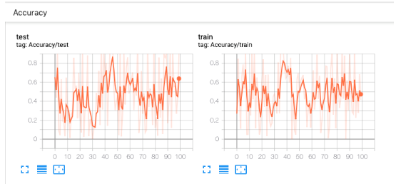
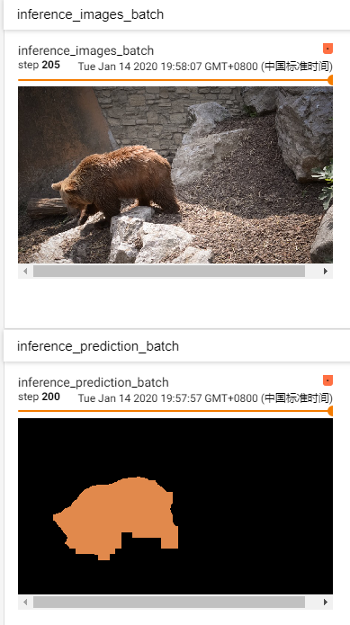

Pytorch Tensorboard的简单使用

<!--more-->
Tensorboard作为将训练过程中各个参数进行记录并可视化输出的工具，对我们来说非常重要，掌握这个工具可以给我们带来很多便利。下面结合最近使用tensorboard的实际情况简单做一下记录。

### torch.utils.tensorboard
torch中整合了tensorboard，我们可以直接使用
想要在网页进行可视化，需要安装tensorboard：
```
pip install tensorboard
tensorboard --logdir=*** --port=***
```

#### 一个简单的使用样例：
```
import torch
from torch.utils.tensorboard import SummaryWriter

writer = SummaryWriter(logdir='./exp1/')
***
***
***
writer.add_scalar('Loss', loss_value, iter) #在面板增加一个scalar记录loss变化
writer.add_image('image', train_image, iter) #在面板的一个iter添加单个图片train_image
writer.add_images('images', train_images, iter) #在面板的一个iter添加一个batch
```

目前只用到这三个比较简单的，有几点需要注意：
add_scalar中的loss_value的类型需要是**float or string/blobname** 

add_image中的train_image类型需要是 **(3, H, W)的tensor或者numpyarray**

add_images中的train_images类型需要是 **(N, 3, H, W)的tensor或者numpyarray**

运行时会在你指定的`./exp1/`文件夹下产生log文件，如果没有指定文件夹会自动生成./runs文件夹，生成文件后就可以去文件夹下执行
```
tensorboard --logdir=./ --port=34567
```
然后去网页中输入ip后面加上端口号即可查看log ***调试服务器只开放端口减一的http端口，所以如果镜像端口为25000 则port填24999 访问时也是***  
后续如果用到别的 会再过来更新


